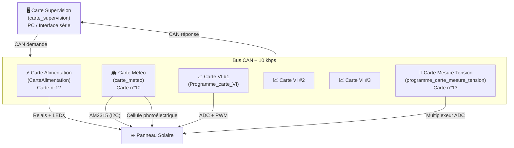
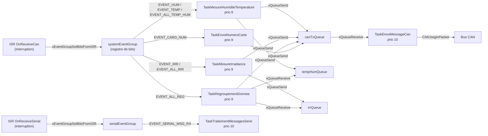
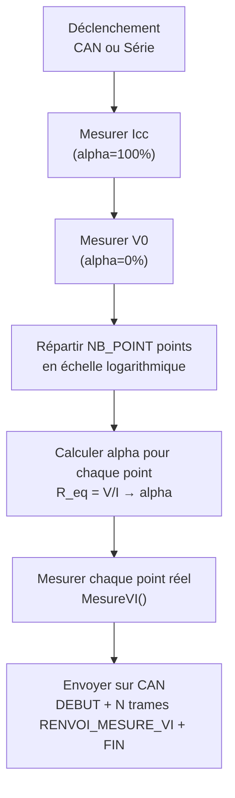

# Projet LAOS – Système de surveillance de panneaux solaires

Système embarqué multi-cartes ESP32 pour la surveillance et la caractérisation de panneaux solaires photovoltaïques. Les cartes communiquent via un bus **CAN à 10 kbps** et s'appuient sur **FreeRTOS** pour les tâches parallèles.

---

## Architecture du système



---

## Cartes du système

| Carte | Dossier | N° carte | Rôle principal | FreeRTOS |
|-------|---------|----------|----------------|----------|
| Alimentation | `CarteAlimentation/` | 12 | Contrôle relais + LEDs état | Non |
| Météo | `carte_meteo/` | 10 | Température, humidité, irradiance | Oui – 6 tâches |
| Mesure I-V | `Programme_carte_VI/` | 1 à 5 | Courbe courant-tension du panneau | Oui – 6 tâches |
| Mesure tension string | `programme_carte_mesure_tension/` | 13 | Tensions/courant sur 5 branches | Non |
| Supervision | `carte_supervision/` | – | Relais série ↔ CAN | Non |

---

## Protocole CAN

### IDs des messages

| ID | Nom | Direction | Description |
|----|-----|-----------|-------------|
| 0 | `CAN_ID_DEMANDE_NUM_CARTE` | Supervision → Toutes | Demande d'identification |
| 1 | `CAN_ID_DEMANDE_ALIMENTATION` | Supervision → Alim | `data[0]` = 1 allume, 0 éteint |
| 2 | `CAN_ID_DEMANDE_HUMIDITE` | Supervision → Météo | Demande humidité seule |
| 3 | `CAN_ID_DEMANDE_IRRADIANCE` | Supervision → Météo | Demande irradiance seule |
| 4 | `CAN_ID_DEMANDE_TEMP_EXTERIEUR` | Supervision → Météo | Demande température ext. seule |
| 5 | `CAN_ID_DEMANDE_HUM_IRR_TEMP_EXT` | Supervision → Météo | Demande groupée : hum + irr + temp |
| 7 | `CAN_ID_DEBUT_TRANSMISSION` | Carte → Supervision | Marqueur début de séquence |
| 8 | `CAN_ID_FIN_TRANSMISSION` | Carte → Supervision | Marqueur fin de séquence |
| 10 | `CAN_ID_RENVOI_NUM_CARTE` | Toutes → Supervision | Numéro de la carte (`data[0]`) |
| 11 | `CAN_ID_DEMANDE_MESURE_VI` | Supervision → VI | `data[0]` = numéro de carte cible |
| 12 | `CAN_ID_DEMANDE_TEMP_PANNEAU` | Supervision → VI | `data[0]` = numéro de carte cible |
| 18 | `CAN_ID_RENVOI_TEMP_PANNEAU` | VI → Supervision | `data[0]`=signe, `data[1]`=valeur, `data[2]`=n° carte |
| 19 | `CAN_ID_RENVOI_MESURE_VI` | VI → Supervision | `data[0-1]`=tension×100, `data[2-3]`=courant×100, `data[4]`=n° carte |
| 42 | `CAN_ID_RENVOI_HUMIDITE` | Météo → Supervision | `data[0-1]` = humidité × 100 (entier 16 bits) |
| 43 | `CAN_ID_RENVOI_TEMPERATURE` | Météo → Supervision | `data[0-1]` = température × 100 (entier 16 bits) |
| 44 | `CAN_ID_RENVOI_IRRADIANCE` | Météo → Supervision | `data[0-1]` = irradiance × 100 (entier 16 bits) |
| 45 | `CAN_ID_RENVOI_HUM_IRR_TEMP_EXT` | Météo → Supervision | 6 octets : hum, temp, irr × 100 chacun |
| 50 | `CAN_ID_DEMANDE_TENSION_STRING` | Supervision → Tension | `data[0]` = numéro de string |
| 51 | `CAN_ID_RENVOI_TENSION_STRING` | Tension → Supervision | `data[0]`=indice, `data[1-2]`=valeur |
| 52 | `CAN_ID_DEMANDE_COURANT_STRING` | Supervision → Tension | – |
| 53 | `CAN_ID_RENVOI_COURANT_STRING` | Tension → Supervision | – |

### Encodage des flottants sur 2 octets

Toutes les valeurs flottantes (température, humidité, tension, courant) sont encodées ainsi :

```
valeur_entiere = valeur_float × 100
data[n]   = valeur_entiere / 256   (octet fort)
data[n+1] = valeur_entiere % 256   (octet faible)

Décodage : valeur_float = (data[n] × 256 + data[n+1]) / 100.0
```

---

## Carte Météo – Architecture FreeRTOS



| Tâche | Priorité | Pile | Rôle |
|-------|----------|------|------|
| `TaskEnvoiMessageCan` | 10 | 3072 | Envoie les trames en attente dans `canTxQueue` |
| `TaskTraitementMessagesSerie` | 10 | 2048 | Interprète les commandes série |
| `TaskMesureHumiditeTemperature` | 9 | 2048 | Lit le capteur AM2315 via I2C |
| `TaskMesureIrradiance` | 9 | 2048 | Lit la cellule photoélectrique (ADC) |
| `TaskRegroupementDonnee` | 9 | 2048 | Assemble les mesures en un seul message CAN |
| `TaskEnvoiNumeroCarte` | 9 | 2048 | Répond aux demandes d'identification |

---

## Carte VI – Architecture FreeRTOS

| Tâche | Priorité | Pile | Rôle |
|-------|----------|------|------|
| `TaskEnvoiMessageCan` | 10 | 2048 | Envoie les trames CAN de `balTxCanMsg` |
| `TaskTraitementMessageSerie` | 9 | 3072 | Interprète les commandes série |
| `TaskMesureCourbeVI` | 5 | 4096 | Trace la courbe I-V complète (NB_POINT points) |
| `TaskMesurePointVI` | 5 | 3072 | Mesure un point I-V à alpha fixé |
| `TaskMesureTemperatureTc74` | 5 | 3072 | Lit le capteur de température TC74 (I2C) |
| `TaskEnvoiNumCarte` | 5 | 2048 | Répond aux demandes d'identification |

### Algorithme de la courbe I-V



---

## Broches matérielles

### Carte Alimentation

| Broche | Rôle |
|--------|------|
| GPIO 25 | Relais (OUTPUT) |
| GPIO 18 | LED verte |
| GPIO 19 | LED rouge |

### Carte Météo

| Broche | Rôle |
|--------|------|
| GPIO 34 | Cellule photoélectrique (ADC) |
| I2C SDA/SCL | Capteur AM2315 |

### Carte Mesure I-V

| Broche | Rôle |
|--------|------|
| GPIO 25 | DIP switch BP1 (bit 0 numéro de carte) |
| GPIO 26 | DIP switch BP2 (bit 1) |
| GPIO 27 | DIP switch BP3 (bit 2) |
| GPIO 14 | DIP switch BP4 (bit 3) |
| GPIO 18 | Relais de connexion panneau |
| GPIO 19 | PWM charge (canal 0, 50 kHz, 9 bits) |
| GPIO 32 | ADC tension panneau |
| GPIO 33 | ADC courant panneau |
| I2C 0x48 | Capteur TC74 (température) |

### Carte Mesure Tension String

| Broche | Rôle |
|--------|------|
| GPIO 25 | Sélection multiplexeur A |
| GPIO 33 | Sélection multiplexeur B |
| GPIO 32 | Sélection multiplexeur C |
| GPIO 36 | Sortie multiplexeur 1 |
| GPIO 39 | Sortie multiplexeur 2 |
| GPIO 34 | Sortie multiplexeur 3 |
| GPIO 35 | Sortie multiplexeur 4 |

---

## Commandes série

### Carte Supervision → bus CAN

| Commande | Exemple | Effet |
|----------|---------|-------|
| `R <0/1>` | `R 1` | Allume (`1`) ou éteint (`0`) le relais alimentation |
| `M` | `M` | Demande les mesures météo groupées |
| `VI <n>` | `VI 3` | Demande la courbe I-V de la carte n°3 |
| `T <n>` | `T 2` | Demande la température du panneau sur la carte n°2 |
| `N` | `N` | Demande l'identification de toutes les cartes |

### Carte VI (débogage local)

| Commande | Exemple | Effet |
|----------|---------|-------|
| `M <alpha>` | `M 50` | Mesure un point I-V à 50% de rapport cyclique |
| `A` | `A` | Déclenche la mesure complète de la courbe I-V |
| `T` | `T` | Mesure la température du panneau |

### Carte Alimentation (débogage local)

| Commande | Exemple | Effet |
|----------|---------|-------|
| `R <0/1>` | `R 1` | Commande directe du relais |

### Carte Météo (débogage local)

| Commande | Exemple | Effet |
|----------|---------|-------|
| `M` | `M` | Déclenche l'envoi groupé des mesures météo |

---

## Mise en route

### Prérequis

- [PlatformIO](https://platformio.org/) (CLI ou extension VSCode)
- ESP32 DevKit v1 (ou compatible)
- Bus CAN physique avec transceivers (ex. MCP2551 ou SN65HVD230)

### Compilation et flash

Chaque sous-dossier est un projet PlatformIO indépendant.

```bash
# Exemple pour la carte météo
cd carte_meteo
pio run --target upload

# Ouvrir le moniteur série
pio device monitor --baud 115200
```

### Configuration réseau CAN

Toutes les cartes sont câblées en parallèle sur le bus CAN à **10 kbps**. Ajouter des résistances de terminaison de **120 Ω** aux deux extrémités du bus.

---

## Structure du dépôt

```
Projet_LAOS/
├── CarteAlimentation/          # Contrôle relais alimentation
│   └── src/
│       ├── main_carte_alim.cpp
│       └── can_id.h
├── carte_meteo/                # Mesures météorologiques (FreeRTOS)
│   └── src/
│       ├── main_carte_meteo_RTOS.cpp
│       └── can_id.h
├── Programme_carte_VI/         # Caractérisation I-V panneau (FreeRTOS)
│   └── src/
│       ├── main_carte_VI_RTOS.cpp
│       ├── main_carte_VI_RTOS.h
│       ├── TC74.cpp / TC74.h
│       └── can_id.h
├── programme_carte_mesure_tension/  # Mesure tensions strings
│   └── src/
│       └── main2.cpp
└── carte_supervision/          # Interface série ↔ CAN
    └── src/
        └── main_supervision.cpp
```

---

## Technologies utilisées

| Technologie | Usage |
|-------------|-------|
| ESP32 (Xtensa LX6) | Microcontrôleur principal de chaque carte |
| FreeRTOS | Multitâche sur cartes Météo et VI |
| CAN bus 10 kbps | Communication inter-cartes |
| PlatformIO | Build system et gestion des dépendances |
| Adafruit AM2315 | Capteur température/humidité (I2C) |
| TC74 | Capteur température panneau (I2C) |
| PWM 50 kHz 9 bits | Contrôle de la charge résistive pour courbe I-V |
