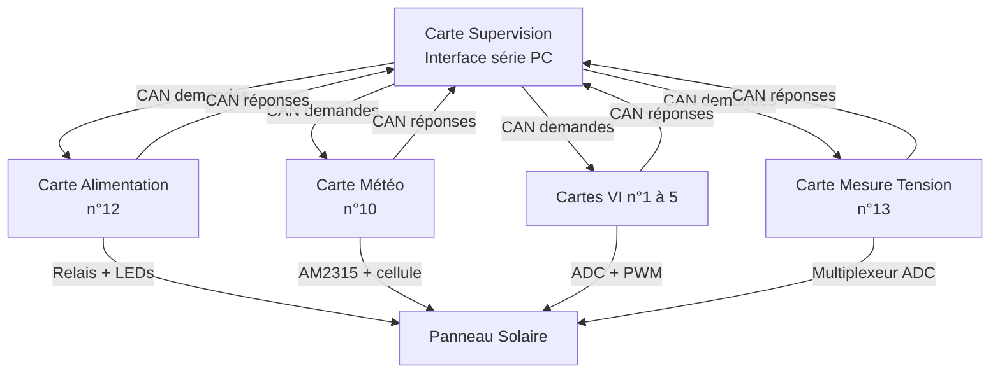
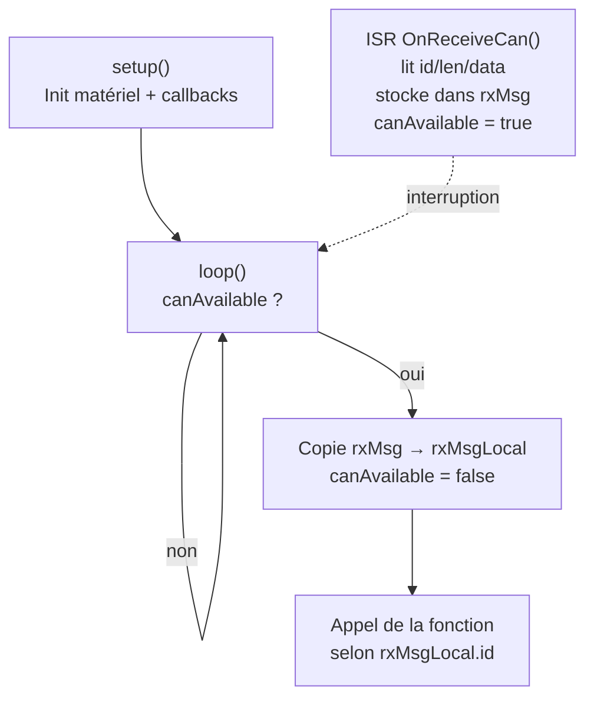

# Projet LAOS – Système de surveillance de panneaux solaires

Système embarqué multi-cartes ESP32 pour la surveillance et la caractérisation de panneaux solaires photovoltaïques. Les cartes communiquent via un bus **CAN à 10 kbps**. Chaque carte utilise une architecture **séquentielle** simple (`setup()` + `loop()` + ISR + flag), accessible à des étudiants de BUT GEII.

---

## Architecture du système



---

## Cartes du système

| Carte | Dossier | N° carte | Rôle principal | Architecture |
|-------|---------|:--------:|----------------|:---:|
| Alimentation | `carte_alimentation/` | 12 | Contrôle relais + LEDs état | Séquentielle |
| Météo | `carte_meteo/` | 10 | Température, humidité, irradiance | Séquentielle |
| Mesure I-V | `carte_vi/` | 1 à 5 | Courbe courant-tension du panneau | Séquentielle |
| Mesure tension string | `carte_mesure_tension/` | 13 | Tensions/courant sur 4 strings × 5 branches | Séquentielle |
| Supervision | `carte_supervision/` | – | Relais série vers CAN | Séquentielle |

---

## Protocole CAN

### Organisation par zones

Les identifiants sont organisés en **zones de 256 IDs** selon les 4 bits de poids fort. Cette structure permet à chaque carte d'utiliser un filtre matériel pour ne recevoir que les messages qui la concernent.

| Zone | Plage | Destinataire / source |
|:---:|:---:|---|
| `0x0xx` | 0x000 – 0x0FF | Broadcast (toutes les cartes écoutent) |
| `0x1xx` | 0x100 – 0x1FF | Carte Alimentation |
| `0x2xx` | 0x200 – 0x2FF | Carte Météo |
| `0x3xx` | 0x300 – 0x3FF | Cartes Mesure I-V |
| `0x4xx` | 0x400 – 0x4FF | Carte Mesure Tension |

Plus l'ID est petit, plus l'arbitrage CAN donne la priorité au message.

### Identifiants des messages

| ID | Nom | Direction | Description |
|:--:|-----|-----------|-------------|
| **— Zone broadcast (0x000 – 0x0FF) —** | | | |
| `0x010` | `CAN_ID_DEBUT_TRANSMISSION` | Carte → Sup | Marqueur début de rafale |
| `0x011` | `CAN_ID_FIN_TRANSMISSION` | Carte → Sup | Marqueur fin de rafale |
| `0x020` | `CAN_ID_DEMANDE_NUM_CARTE` | Sup → Toutes | Demande d'identification |
| `0x021` | `CAN_ID_RENVOI_NUM_CARTE` | Toutes → Sup | `data[0]` = numéro de carte |
| **— Zone Alimentation (0x100 – 0x1FF) —** | | | |
| `0x100` | `CAN_ID_DEMANDE_ALIMENTATION` | Sup → Alim | `data[0]` : 1=allumer, 0=éteindre |
| **— Zone Météo (0x200 – 0x2FF) —** | | | |
| `0x200` | `CAN_ID_DEMANDE_HUM_IRR_TEMP_EXT` | Sup → Météo | Mesure groupée (3 grandeurs) |
| `0x201` | `CAN_ID_DEMANDE_HUMIDITE` | Sup → Météo | Humidité seule |
| `0x202` | `CAN_ID_DEMANDE_TEMP_EXTERIEUR` | Sup → Météo | Température extérieure seule |
| `0x203` | `CAN_ID_DEMANDE_IRRADIANCE` | Sup → Météo | Irradiance seule |
| `0x280` | `CAN_ID_RENVOI_HUM_IRR_TEMP_EXT` | Météo → Sup | 6 octets : hum, temp, irr × 100 |
| `0x281` | `CAN_ID_RENVOI_HUMIDITE` | Météo → Sup | humidité × 100 |
| `0x282` | `CAN_ID_RENVOI_TEMPERATURE` | Météo → Sup | température × 100 |
| `0x283` | `CAN_ID_RENVOI_IRRADIANCE` | Météo → Sup | irradiance × 100 |
| **— Zone Mesure I-V (0x300 – 0x3FF) —** | | | |
| `0x300` | `CAN_ID_DEMANDE_MESURE_VI` | Sup → VI | `data[0]` = numéro de carte cible |
| `0x301` | `CAN_ID_DEMANDE_TEMP_PANNEAU` | Sup → VI | `data[0]` = numéro de carte cible |
| `0x380` | `CAN_ID_RENVOI_MESURE_VI` | VI → Sup | `data[0-1]` V×100, `[2-3]` I×100, `[4]` n° carte |
| `0x381` | `CAN_ID_RENVOI_TEMP_PANNEAU` | VI → Sup | `data[0]` signe, `[1]` °C, `[2]` n° carte |
| **— Zone Mesure Tension (0x400 – 0x4FF) —** | | | |
| `0x400` | `CAN_ID_DEMANDE_TENSION_STRING` | Sup → Tension | `data[0]` = numéro de string (1–4) |
| `0x401` | `CAN_ID_DEMANDE_COURANT_STRING` | Sup → Tension | Pas de data (DLC=0) |
| `0x480` | `CAN_ID_RENVOI_TENSION_STRING` | Tension → Sup | `data[0]`=n° string, `[1]`=n° panneau, `[2-3]`=V×100 |
| `0x481` | `CAN_ID_RENVOI_COURANT_STRING` | Tension → Sup | `data[0-1]`=I1×100, `[2-3]`=I2×100, `[4-5]`=I3×100, `[6-7]`=I4×100 |

### Encodage des flottants sur 2 octets

Toutes les valeurs flottantes sont encodées en entier 16 bits big-endian :

```
valeur_entiere = valeur_float × 100
data[n]   = valeur_entiere / 256   (octet fort)
data[n+1] = valeur_entiere % 256   (octet faible)

Décodage : valeur_float = (data[n] × 256 + data[n+1]) / 100.0
```

---

## Patron de programmation séquentiel (ISR + flag)

Toutes les cartes (sauf mesure_tension) utilisent le même schéma :



L'interruption CAN ne fait que mémoriser le message et lever un drapeau ; tout le traitement (mesure, calcul, envoi) se fait dans le `loop()` hors interruption.

---

## Broches matérielles

### Carte Alimentation

| Broche | Rôle |
|:------:|------|
| GPIO 25 | Relais (OUTPUT) |
| GPIO 18 | LED verte |
| GPIO 19 | LED rouge |

### Carte Météo

| Broche | Rôle |
|:------:|------|
| GPIO 34 | Cellule photoélectrique (ADC) |
| I2C SDA/SCL | Capteur AM2315 |

### Carte Mesure I-V

| Broche | Rôle |
|:------:|------|
| GPIO 25 | DIP switch BP1 (bit 0 numéro de carte) |
| GPIO 26 | DIP switch BP2 (bit 1) |
| GPIO 27 | DIP switch BP3 (bit 2) |
| GPIO 14 | DIP switch BP4 (bit 3) |
| GPIO 18 | Relais de connexion panneau |
| GPIO 19 | PWM charge (canal 0, 50 kHz, 9 bits) |
| GPIO 32 | ADC tension panneau |
| GPIO 33 | ADC courant panneau |
| I2C 0x48 | Capteur TC74 (température) |

### Carte Mesure Tension String

| Broche | Rôle |
|:------:|------|
| GPIO 25 | Sélection multiplexeur A |
| GPIO 33 | Sélection multiplexeur B |
| GPIO 32 | Sélection multiplexeur C |
| GPIO 36 | Sortie multiplexeur 1 |
| GPIO 39 | Sortie multiplexeur 2 |
| GPIO 34 | Sortie multiplexeur 3 |
| GPIO 35 | Sortie multiplexeur 4 |

---

## Commandes série

### Carte Supervision vers bus CAN

| Commande | Exemple | Effet |
|----------|---------|-------|
| `R <0\|1>` | `R 1` | Allume (1) ou éteint (0) le relais alimentation |
| `M` | `M` | Demande les mesures météo groupées |
| `VI <n>` | `VI 3` | Demande la courbe I-V de la carte n°3 |
| `T <n>` | `T 2` | Demande la température du panneau sur la carte n°2 |
| `N` | `N` | Demande l'identification de toutes les cartes |
| `V <n>` | `V 2` | Demande les 5 tensions du string n°2 |
| `C` | `C` | Demande les courants des 4 strings |

La supervision retransmet les réponses CAN sur la liaison série au format CSV. Voir [`docs/serial_protocol.md`](docs/serial_protocol.md) pour le protocole complet.

### Carte VI – débogage local

| Commande | Exemple | Effet |
|----------|---------|-------|
| `M <alpha>` | `M 50` | Mesure un point I-V à 50% de rapport cyclique |
| `A` | `A` | Déclenche la mesure complète de la courbe I-V |
| `T` | `T` | Mesure la température du panneau |

### Carte Alimentation – débogage local

| Commande | Effet |
|----------|-------|
| `R 1` | Ferme le relais |
| `R 0` | Ouvre le relais |

### Carte Météo – débogage local

| Commande | Effet |
|----------|-------|
| `M` | Déclenche l'envoi groupé des mesures météo |

### Carte Mesure Tension – débogage local

| Commande | Exemple | Effet |
|----------|---------|-------|
| `R <n>` | `R 2` | Mesure les 5 tensions du string n°2 |
| `T` | `T` | Mesure les courants des 4 strings |
| `N` | `N` | Envoie le numéro de carte sur le bus CAN |

> **Note :** Pour le protocole série complet (formats des réponses, schémas de flux), voir [`docs/serial_protocol.md`](docs/serial_protocol.md).
> Pour le protocole CAN détaillé, voir [`docs/can_protocol.md`](docs/can_protocol.md).

---

## Mise en route

### Prérequis

- [PlatformIO](https://platformio.org/) (CLI ou extension VSCode)
- ESP32 DevKit v1 (ou compatible)
- Bus CAN physique avec transceivers (ex. SN65HVD230)

### Compilation et flash

```bash
# Exemple pour la carte météo
cd carte_meteo
pio run --target upload

# Ouvrir le moniteur série
pio device monitor --baud 115200
```

### Configuration réseau CAN

Toutes les cartes sont câblées en parallèle sur le bus CAN à **10 kbps**. Ajouter des résistances de terminaison de **120 Ohm** aux deux extrémités du bus.

---

## Structure du dépôt

```
Projet_LAOS/
├── carte_alimentation/              # Contrôle relais alimentation
│   └── src/
│       ├── main_carte_alimentation.cpp
│       └── can_id.h
├── carte_meteo/                     # Mesures météorologiques
│   └── src/
│       ├── main_carte_meteo.cpp
│       └── can_id.h
├── carte_vi/                        # Caractérisation I-V panneau
│   └── src/
│       ├── main_carte_vi.cpp
│       ├── main_carte_vi.h
│       ├── tc74.cpp / tc74.h
│       └── can_id.h
├── carte_mesure_tension/            # Mesure tensions strings (encore FreeRTOS)
│   └── src/
│       ├── main_carte_mesure_tension.cpp
│       └── can_id.h
├── carte_supervision/               # Interface série vers CAN
│   └── src/
│       ├── main_supervision.cpp
│       └── can_id.h
├── docs/                            # Documentation détaillée
└── Doxyfile                         # Configuration Doxygen
```

---

## Technologies utilisées

| Technologie | Usage |
|-------------|-------|
| ESP32 (Xtensa LX6) | Microcontrôleur principal de chaque carte |
| Arduino framework (ESP32) | Couche d'abstraction matérielle |
| CAN bus 10 kbps | Communication inter-cartes |
| PlatformIO | Build system et gestion des dépendances |
| Adafruit AM2315 | Capteur température/humidité (I2C) |
| TC74 | Capteur température panneau (I2C) |
| PWM 50 kHz 9 bits | Contrôle de la charge résistive pour courbe I-V |
