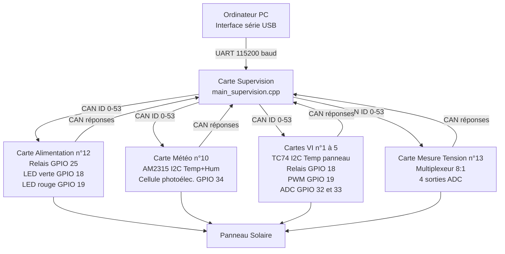

# Architecture du système

## Vue d'ensemble

Le projet LAOS est composé de **5 types de cartes ESP32** reliées par un bus CAN à 10 kbps. La carte supervision joue le rôle de maître : elle émet les demandes de mesure et reçoit les réponses de toutes les autres cartes.



---

## Flux de données

```mermaid
sequenceDiagram
    participant PC as Ordinateur PC
    participant SUP as Carte Supervision
    participant ALI as Carte Alimentation
    participant MET as Carte Météo
    participant VI as Carte VI n°X
    participant TEN as Carte Tension

    Note over PC,TEN: Initialisation - identification des cartes
    PC->>SUP: N
    SUP->>ALI: CAN ID=0
    SUP->>MET: CAN ID=0
    SUP->>VI: CAN ID=0
    SUP->>TEN: CAN ID=0
    ALI-->>SUP: CAN ID=10 data=12
    MET-->>SUP: CAN ID=10 data=10
    VI-->>SUP: CAN ID=10 data=X
    TEN-->>SUP: CAN ID=10 data=13
    SUP-->>PC: 0;12 / 0;10 / ...

    Note over PC,TEN: Mesure météo groupée
    PC->>SUP: M
    SUP->>MET: CAN ID=5
    MET-->>SUP: CAN ID=7 DEBUT
    MET-->>SUP: CAN ID=45 hum+temp+irr
    MET-->>SUP: CAN ID=8 FIN
    SUP-->>PC: 10;hum;temp;irr

    Note over PC,TEN: Mesure courbe I-V carte n°3
    PC->>SUP: VI 3
    SUP->>VI: CAN ID=11 data=3
    VI-->>SUP: CAN ID=7 DEBUT
    loop 23 fois
        VI-->>SUP: CAN ID=19 tension+courant+n°carte
    end
    VI-->>SUP: CAN ID=8 FIN
    SUP-->>PC: 1;3;V;I x23
```

---

## Anti-collision CAN pour l'identification

Lors d'une demande `CAN_ID_DEMANDE_NUM_CARTE`, toutes les cartes répondent. Pour éviter les collisions, chaque carte attend avant de répondre :

```
délai = numCarte × 10 ms
```

La carte n°1 répond après 10 ms, la n°12 après 120 ms, etc.

---

## Technologies par couche

| Couche | Technologie | Rôle |
|--------|-------------|------|
| Matériel | ESP32 Xtensa LX6 dual-core 240 MHz | MCU de chaque carte |
| Réseau | CAN 2.0A, 10 kbps, trames standard 11 bits | Communication inter-cartes |
| OS temps réel | FreeRTOS (intégré Arduino ESP32) | Multitâche sur cartes Météo et VI |
| Build system | PlatformIO | Compilation, dépendances, flash |
| Capteurs | AM2315 I2C, TC74 I2C, ADC interne ESP32 | Acquisition physique |
| Actionneurs | Relais GPIO, PWM 50 kHz 9 bits | Contrôle charge et alimentation |
