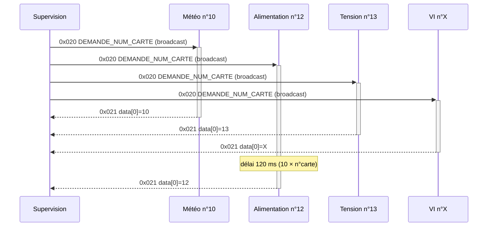
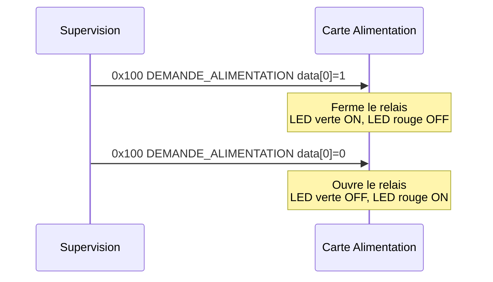
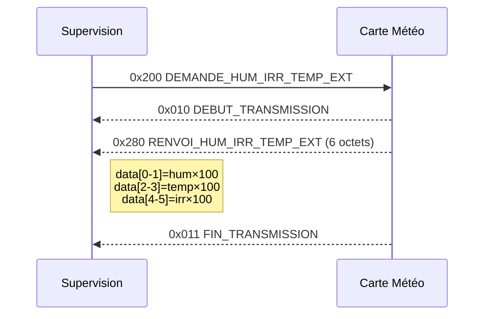
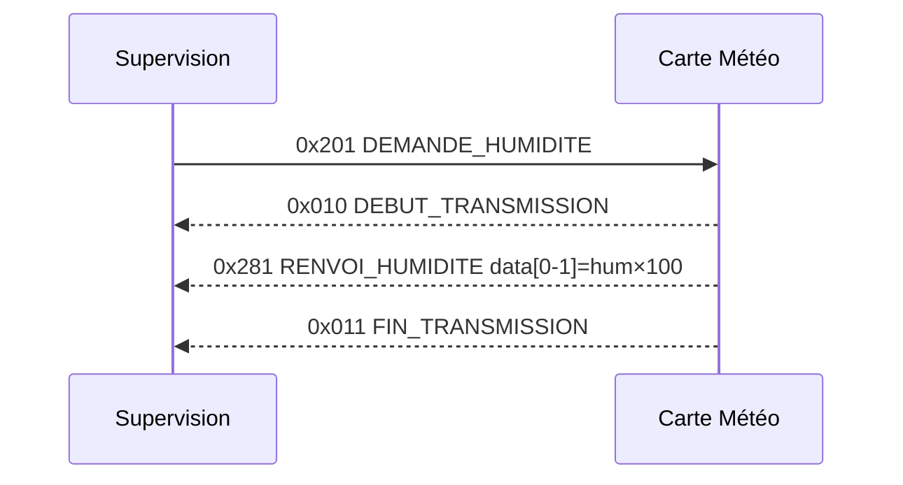
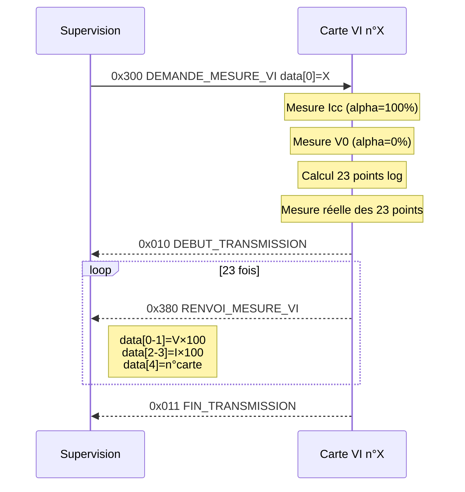
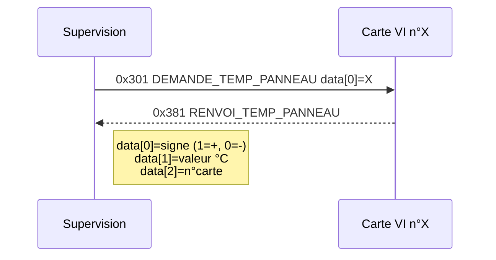
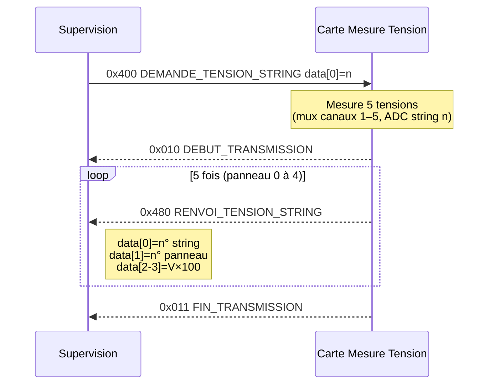
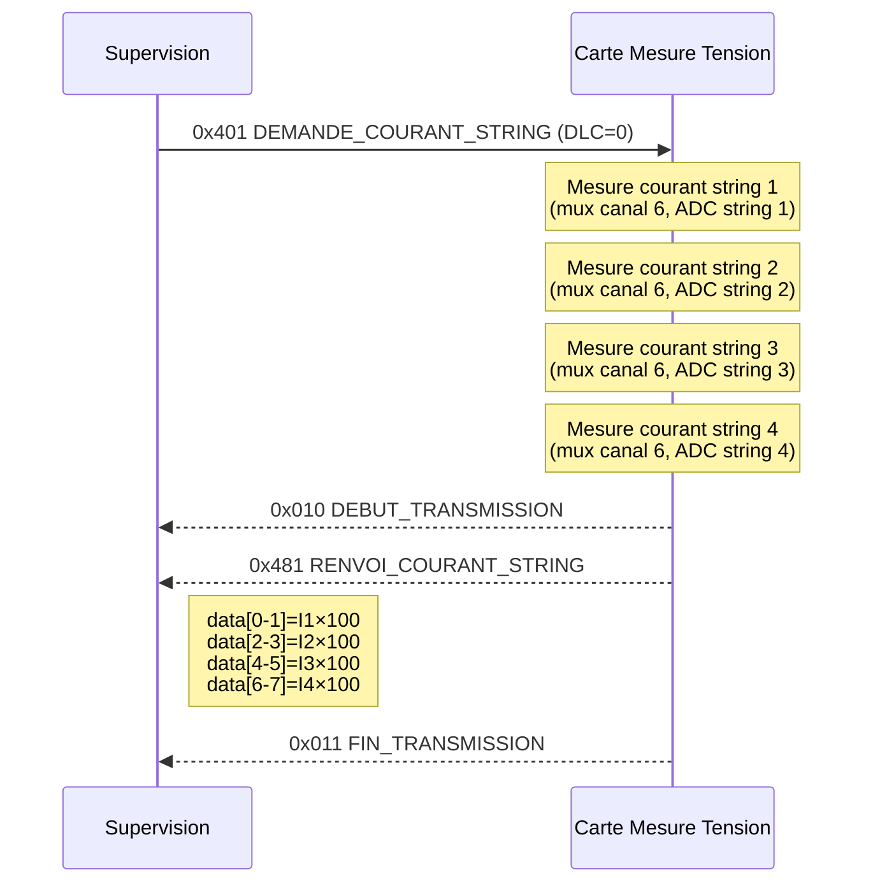
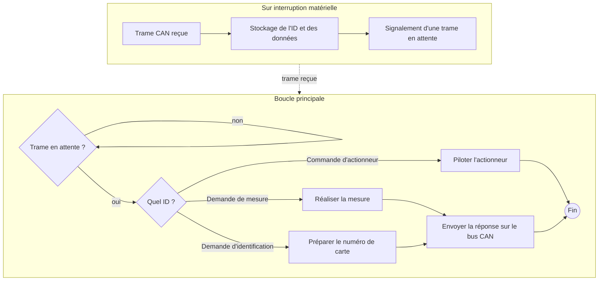

# Protocole CAN

## Paramètres physiques

| Paramètre | Valeur |
|-----------|--------|
| Vitesse | 10 kbps |
| Format | Standard (11 bits d'identifiant) |
| Résistances de terminaison | 120 Ohm aux deux extrémités |
| Longueur de données max | 8 octets |

---

## Organisation des identifiants

Les identifiants sont organisés en **zones de 256 IDs** (4 bits de poids fort) :

| Zone | Plage | Destinataire / source |
|:---:|:---:|---|
| `0x0xx` | 0x000 – 0x0FF | **Broadcast** – toutes les cartes écoutent |
| `0x1xx` | 0x100 – 0x1FF | Carte **Alimentation** |
| `0x2xx` | 0x200 – 0x2FF | Carte **Météo** |
| `0x3xx` | 0x300 – 0x3FF | Cartes **Mesure I-V** (n°1 à 5) |
| `0x4xx` | 0x400 – 0x4FF | Carte **Mesure Tension** |

Au sein d'une zone, les **demandes** (Supervision → Carte) sont en `0xZ0x..0xZ7x` et les **réponses** (Carte → Supervision) en `0xZ8x..0xZFx`.

**Priorité CAN :** plus l'identifiant est petit, plus l'arbitrage CAN donne la priorité au message. La zone broadcast a donc la priorité la plus haute, suivie d'Alim, puis Météo, etc.

---

## Tableau complet des identifiants

| ID | Nom symbolique | Direction | DLC | Description |
|:--:|----------------|-----------|:---:|-------------|
| **— Zone broadcast (0x000 – 0x0FF) —** | | | | |
| `0x010` | `CAN_ID_DEBUT_TRANSMISSION` | Carte → Sup | 0 | Marqueur début de rafale multi-trames |
| `0x011` | `CAN_ID_FIN_TRANSMISSION` | Carte → Sup | 0 | Marqueur fin de rafale multi-trames |
| `0x020` | `CAN_ID_DEMANDE_NUM_CARTE` | Sup → Toutes | 0 | Demande d'identification générale (broadcast) |
| `0x021` | `CAN_ID_RENVOI_NUM_CARTE` | Toutes → Sup | 1 | `data[0]` = numéro de la carte |
| **— Zone Alimentation (0x100 – 0x1FF) —** | | | | |
| `0x100` | `CAN_ID_DEMANDE_ALIMENTATION` | Sup → Alim | 1 | `data[0]` : 1 = allumer, 0 = éteindre |
| **— Zone Météo (0x200 – 0x2FF) —** | | | | |
| `0x200` | `CAN_ID_DEMANDE_HUM_IRR_TEMP_EXT` | Sup → Météo | 0 | Demande groupée (humidité + temp + irradiance) |
| `0x201` | `CAN_ID_DEMANDE_HUMIDITE` | Sup → Météo | 0 | Demande humidité seule |
| `0x202` | `CAN_ID_DEMANDE_TEMP_EXTERIEUR` | Sup → Météo | 0 | Demande température extérieure seule |
| `0x203` | `CAN_ID_DEMANDE_IRRADIANCE` | Sup → Météo | 0 | Demande irradiance seule |
| `0x280` | `CAN_ID_RENVOI_HUM_IRR_TEMP_EXT` | Météo → Sup | 6 | `data[0-1]`=hum×100, `[2-3]`=temp×100, `[4-5]`=irr×100 |
| `0x281` | `CAN_ID_RENVOI_HUMIDITE` | Météo → Sup | 2 | `data[0-1]` = humidité × 100 (big-endian) |
| `0x282` | `CAN_ID_RENVOI_TEMPERATURE` | Météo → Sup | 2 | `data[0-1]` = température × 100 (big-endian) |
| `0x283` | `CAN_ID_RENVOI_IRRADIANCE` | Météo → Sup | 2 | `data[0-1]` = irradiance × 100 (big-endian) |
| **— Zone Mesure I-V (0x300 – 0x3FF) —** | | | | |
| `0x300` | `CAN_ID_DEMANDE_MESURE_VI` | Sup → VI | 1 | `data[0]` = numéro de carte cible |
| `0x301` | `CAN_ID_DEMANDE_TEMP_PANNEAU` | Sup → VI | 1 | `data[0]` = numéro de carte cible |
| `0x380` | `CAN_ID_RENVOI_MESURE_VI` | VI → Sup | 5 | `data[0-1]`=V×100, `[2-3]`=I×100, `[4]`=n° carte |
| `0x381` | `CAN_ID_RENVOI_TEMP_PANNEAU` | VI → Sup | 3 | `data[0]`=signe, `[1]`=°C entier, `[2]`=n° carte |
| **— Zone Mesure Tension (0x400 – 0x4FF) —** | | | | |
| `0x400` | `CAN_ID_DEMANDE_TENSION_STRING` | Sup → Tension | 1 | `data[0]` = numéro de string (1 à 4) |
| `0x401` | `CAN_ID_DEMANDE_COURANT_STRING` | Sup → Tension | 0 | Demande les courants des 4 strings (pas de data) |
| `0x480` | `CAN_ID_RENVOI_TENSION_STRING` | Tension → Sup | 4 | `data[0]`=n° string, `[1]`=n° panneau, `[2-3]`=V×100 |
| `0x481` | `CAN_ID_RENVOI_COURANT_STRING` | Tension → Sup | 8 | `data[0-1]`=I1×100, `[2-3]`=I2×100, `[4-5]`=I3×100, `[6-7]`=I4×100 |

---

## Filtrage matériel des récepteurs

L'organisation par zones permet à chaque carte de configurer un **filtre matériel** sur son contrôleur CAN : seuls les messages destinés à la carte (et les broadcasts) déclenchent une interruption.

Un filtre CAN se définit par deux mots de 11 bits : un **filter** (valeur attendue) et un **mask** (bits à comparer). Le message est accepté si `(id_reçu & mask) == (filter & mask)`.

| Carte | `filter` | `mask` | IDs reçus en matériel | Remarque |
|---|:---:|:---:|---|---|
| **Alimentation** | `0x000` | `0x600` | `0x000` – `0x1FF` | Broadcast + zone Alim, filtre exact |
| **Météo** | `0x000` | `0x400` | `0x000` – `0x3FF` | Broadcast + zones Alim/Météo/VI ; logiciel ignore Alim et VI |
| **Mesure I-V** | `0x000` | `0x400` | `0x000` – `0x3FF` | Broadcast + zones Alim/Météo/VI ; logiciel ignore Alim et Météo |
| **Mesure Tension** | `0x000` | `0x300` | `0x000-0x0FF` + `0x400-0x4FF` | Broadcast + zone Tension, filtre exact |
| **Supervision** | `0x000` | `0x000` | tous | Reçoit toutes les réponses |

Pour Météo et VI, un filtre unique parfait n'est pas possible (les zones ne partagent pas de préfixe commun). Le filtrage est donc complété en logiciel dans le `loop()`. Une alternative avancée est d'utiliser le mode **dual filter** du contrôleur TWAI de l'ESP32.

---

## Encodage des flottants

Toutes les valeurs physiques sont transmises sous forme d'entiers 16 bits, en **big-endian** (octet fort en premier).

```
Encodage :
  entier    = (int)(valeur_float × 100)
  data[n]   = entier / 256        -- octet fort (MSB)
  data[n+1] = entier % 256        -- octet faible (LSB)

Décodage :
  valeur_float = (data[n] * 256 + data[n+1]) / 100.0f
```

**Exemple** – Température de 23,45 °C :

| Étape | Calcul | Résultat |
|-------|--------|----------|
| Encodage | 23.45 × 100 | entier = 2345 |
| Octet fort | 2345 / 256 | data[0] = 9 |
| Octet faible | 2345 % 256 | data[1] = 41 |
| Décodage | (9 × 256 + 41) / 100.0 | 23.45 ✓ |

---

## Format détaillé des trames

### Identification (`0x021` – `CAN_ID_RENVOI_NUM_CARTE`)

| Octet | data[0] |
|-------|---------|
| Contenu | Numéro de carte |

---

### Contrôle alimentation (`0x100` – `CAN_ID_DEMANDE_ALIMENTATION`)

| Octet | data[0] |
|-------|---------|
| Contenu | Commande relais |
| Valeur | 1 = fermer (alimenter), 0 = ouvrir (couper) |

---

### Météo groupée réponse (`0x280` – `CAN_ID_RENVOI_HUM_IRR_TEMP_EXT`)

| Octet | data[0] | data[1] | data[2] | data[3] | data[4] | data[5] |
|-------|---------|---------|---------|---------|---------|---------|
| Contenu | Hum MSB | Hum LSB | Temp MSB | Temp LSB | Irr MSB | Irr LSB |
| Valeur | Humidité × 100 | | Température × 100 | | Irradiance × 100 | |

---

### Mesure I-V réponse (`0x380` – `CAN_ID_RENVOI_MESURE_VI`)

| Octet | data[0] | data[1] | data[2] | data[3] | data[4] |
|-------|---------|---------|---------|---------|---------|
| Contenu | Tension MSB | Tension LSB | Courant MSB | Courant LSB | N° carte |
| Valeur | Tension × 100 | | Courant × 100 | | 1 à 5 |

---

### Température panneau réponse (`0x381` – `CAN_ID_RENVOI_TEMP_PANNEAU`)

| Octet | data[0] | data[1] | data[2] |
|-------|---------|---------|---------|
| Contenu | Signe | Valeur absolue | N° carte |
| Valeur | 1 = positif, 0 = négatif | Entier °C | 1 à 5 |

---

### Tension string réponse (`0x480` – `CAN_ID_RENVOI_TENSION_STRING`)

Une trame par panneau. La supervision reçoit 5 trames consécutives par string demandé, encadrées par `DEBUT_TRANSMISSION` et `FIN_TRANSMISSION`.

| Octet | data[0] | data[1] | data[2] | data[3] |
|-------|---------|---------|---------|---------|
| Contenu | N° string | N° panneau | Tension MSB | Tension LSB |
| Valeur | 1 à 4 | 0 à 4 | Tension × 100 | |

---

### Courant string réponse (`0x481` – `CAN_ID_RENVOI_COURANT_STRING`)

Une seule trame contenant les 4 courants, encadrée par `DEBUT_TRANSMISSION` et `FIN_TRANSMISSION`.

| Octet | data[0] | data[1] | data[2] | data[3] | data[4] | data[5] | data[6] | data[7] |
|-------|---------|---------|---------|---------|---------|---------|---------|---------|
| Contenu | I1 MSB | I1 LSB | I2 MSB | I2 LSB | I3 MSB | I3 LSB | I4 MSB | I4 LSB |
| Valeur | Courant string 1 × 100 | | Courant string 2 × 100 | | Courant string 3 × 100 | | Courant string 4 × 100 | |

---

## Séquences de communication

### Identification de toutes les cartes

La supervision envoie un unique broadcast. Chaque carte répond avec son numéro.
La carte Alimentation attend `numCarte × 10 ms` avant de répondre pour éviter les collisions ; les autres cartes répondent immédiatement (l'arbitrage CAN gère les collisions éventuelles).



---

### Contrôle du relais alimentation



---

### Mesure météo groupée



---

### Mesure météo individuelle (exemple : humidité)



Le même schéma s'applique pour `DEMANDE_TEMP_EXTERIEUR (0x202)` → `RENVOI_TEMPERATURE (0x282)` et `DEMANDE_IRRADIANCE (0x203)` → `RENVOI_IRRADIANCE (0x283)`.

---

### Mesure courbe I-V



---

### Mesure température d'un panneau (VI)



---

### Mesure tensions d'un string

La supervision demande les tensions du string `n`. La carte renvoie 5 trames (une par panneau) encadrées par les marqueurs de rafale.



---

### Mesure courants des 4 strings

La supervision envoie une demande sans data. La carte renvoie une unique trame de 8 octets avec les 4 courants.



---

## Algorithme générique de réception CAN



L'interruption est volontairement courte (juste stocker la trame et lever un drapeau) pour ne pas bloquer la réception des trames suivantes. Le traitement réel est fait dans la boucle principale.

### Template de code (patron ISR + flag)

```cpp
/* ---- Structure d'un message CAN ------------------------------------ */
typedef struct CanMessage_t
{
  unsigned int  id      = 0;
  char          len     = 0;
  unsigned char data[8] = {0};
} CanMessage_t;

/* ---- Variables globales -------------------------------------------- */
CanMessage_t    rxMsg;
volatile bool   canAvailable = false;

/* ---- ISR CAN – appelée à chaque trame reçue ------------------------ */
void OnReceiveCan(int packetSize)
{
  rxMsg.id  = CAN.packetId();
  rxMsg.len = CAN.packetDlc();
  for (int i = 0; CAN.available(); i++)
  {
    rxMsg.data[i] = CAN.read();
  }
  canAvailable = true;
}

/* ---- setup() – enregistrement du callback -------------------------- */
void setup()
{
  CAN.begin(10E3);
  CAN.onReceive(OnReceiveCan);
}

/* ---- loop() – traitement hors interruption ------------------------- */
void loop()
{
  if (canAvailable)
  {
    canAvailable = false;
    CanMessage_t rxMsgLocal = rxMsg; // copie locale avant tout traitement

    if      (rxMsgLocal.id == CAN_ID_DEMANDE_A) { /* traitement A */ }
    else if (rxMsgLocal.id == CAN_ID_DEMANDE_B) { /* traitement B */ }
    else if (rxMsgLocal.id == CAN_ID_DEMANDE_NUM_CARTE) { EnvoiNumCarte(); }
  }
}
```

La copie locale `rxMsgLocal` garantit la cohérence des données : l'ISR peut être déclenchée à nouveau pendant le traitement et écraser `rxMsg`.

---

## Numéros de cartes

| Numéro | Carte |
|:------:|-------|
| 1 à 5 | Cartes Mesure VI (lu sur DIP switch 4 bits au démarrage) |
| 10 | Carte Météo (fixe dans le firmware) |
| 12 | Carte Alimentation (fixe dans le firmware) |
| 13 | Carte Mesure Tension String (fixe dans le firmware) |
