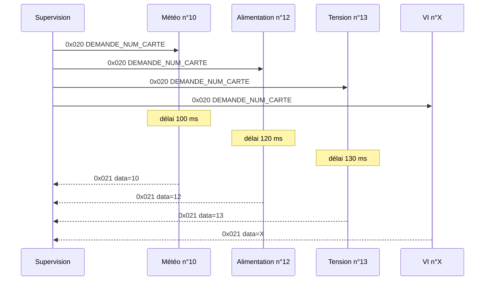
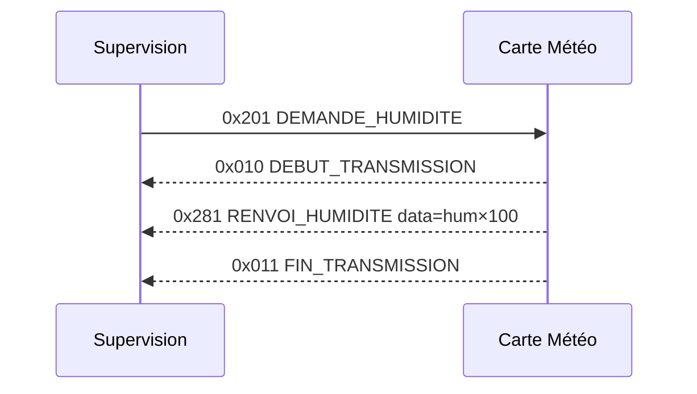
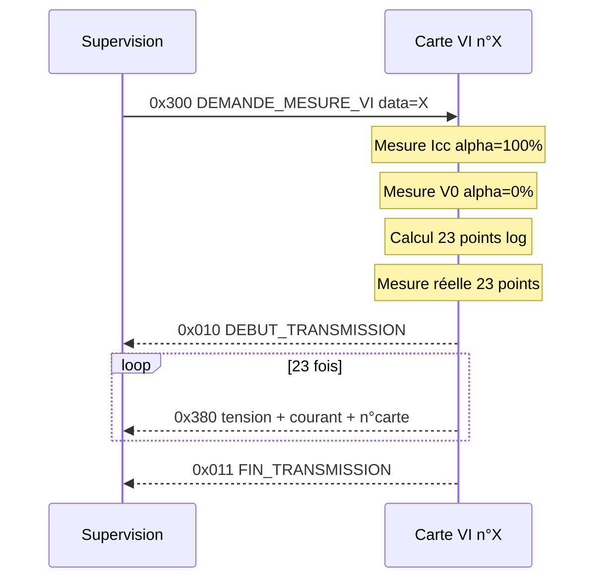

# Protocole CAN

## Paramètres physiques

| Paramètre | Valeur |
|-----------|--------|
| Vitesse | 10 kbps |
| Format | Standard (11 bits d'identifiant) |
| Résistances de terminaison | 120 Ohm aux deux extrémités |
| Longueur de données max | 8 octets |

---

## Organisation des identifiants

Les identifiants sont organisés en **zones de 256 IDs** (4 bits de poids fort) :

| Zone | Plage | Destinataire / source |
|:---:|:---:|---|
| `0x0xx` | 0x000 – 0x0FF | **Broadcast** – toutes les cartes écoutent |
| `0x1xx` | 0x100 – 0x1FF | Carte **Alimentation** |
| `0x2xx` | 0x200 – 0x2FF | Carte **Météo** |
| `0x3xx` | 0x300 – 0x3FF | Cartes **Mesure I-V** (n°1 à 5) |
| `0x4xx` | 0x400 – 0x4FF | Carte **Mesure Tension** |

Au sein d'une zone, les **demandes** (Supervision → Carte) sont en `0xZ0x..0xZ7x` et les **réponses** (Carte → Supervision) en `0xZ8x..0xZFx`.

**Priorité CAN :** plus l'identifiant est petit, plus l'arbitrage CAN donne la priorité au message. La zone broadcast a donc la priorité la plus haute, suivie d'Alim, puis Météo, etc.

---

## Tableau complet des identifiants

| ID | Nom symbolique | Direction | Longueur | Description |
|:--:|----------------|-----------|:--------:|-------------|
| **— Zone broadcast (0x000 – 0x0FF) —** | | | | |
| `0x010` | `CAN_ID_DEBUT_TRANSMISSION` | Carte → Sup | 0 | Marqueur début de rafale multi-trames |
| `0x011` | `CAN_ID_FIN_TRANSMISSION` | Carte → Sup | 0 | Marqueur fin de rafale multi-trames |
| `0x020` | `CAN_ID_DEMANDE_NUM_CARTE` | Sup → Toutes | 0 | Demande d'identification générale |
| `0x021` | `CAN_ID_RENVOI_NUM_CARTE` | Toutes → Sup | 1 | `data[0]` = numéro de la carte |
| **— Zone Alimentation (0x100 – 0x1FF) —** | | | | |
| `0x100` | `CAN_ID_DEMANDE_ALIMENTATION` | Sup → Alim | 1 | `data[0]` : 1=allumer, 0=éteindre |
| **— Zone Météo (0x200 – 0x2FF) —** | | | | |
| `0x200` | `CAN_ID_DEMANDE_HUM_IRR_TEMP_EXT` | Sup → Météo | 0 | Demande groupée (3 mesures) |
| `0x201` | `CAN_ID_DEMANDE_HUMIDITE` | Sup → Météo | 0 | Demande humidité seule |
| `0x202` | `CAN_ID_DEMANDE_TEMP_EXTERIEUR` | Sup → Météo | 0 | Demande température extérieure |
| `0x203` | `CAN_ID_DEMANDE_IRRADIANCE` | Sup → Météo | 0 | Demande irradiance seule |
| `0x280` | `CAN_ID_RENVOI_HUM_IRR_TEMP_EXT` | Météo → Sup | 6 | `data[0-1]`=hum×100, `[2-3]`=temp×100, `[4-5]`=irr×100 |
| `0x281` | `CAN_ID_RENVOI_HUMIDITE` | Météo → Sup | 2 | `data[0-1]` = humidité × 100 |
| `0x282` | `CAN_ID_RENVOI_TEMPERATURE` | Météo → Sup | 2 | `data[0-1]` = température × 100 |
| `0x283` | `CAN_ID_RENVOI_IRRADIANCE` | Météo → Sup | 2 | `data[0-1]` = irradiance × 100 |
| **— Zone Mesure I-V (0x300 – 0x3FF) —** | | | | |
| `0x300` | `CAN_ID_DEMANDE_MESURE_VI` | Sup → VI | 1 | `data[0]` = numéro de carte cible |
| `0x301` | `CAN_ID_DEMANDE_TEMP_PANNEAU` | Sup → VI | 1 | `data[0]` = numéro de carte cible |
| `0x380` | `CAN_ID_RENVOI_MESURE_VI` | VI → Sup | 5 | `data[0-1]`=V×100, `[2-3]`=I×100, `[4]`=n° carte |
| `0x381` | `CAN_ID_RENVOI_TEMP_PANNEAU` | VI → Sup | 3 | `data[0]`=signe, `[1]`=°C, `[2]`=n° carte |
| **— Zone Mesure Tension (0x400 – 0x4FF) —** | | | | |
| `0x400` | `CAN_ID_DEMANDE_TENSION_STRING` | Sup → Tension | 1 | `data[0]` = numéro de string |
| `0x401` | `CAN_ID_DEMANDE_COURANT_STRING` | Sup → Tension | 1 | `data[0]` = numéro de string |
| `0x480` | `CAN_ID_RENVOI_TENSION_STRING` | Tension → Sup | 3 | `data[0]`=indice, `[1-2]`=valeur |
| `0x481` | `CAN_ID_RENVOI_COURANT_STRING` | Tension → Sup | 3 | `data[0]`=indice, `[1-2]`=valeur |

---

## Filtrage matériel des récepteurs

L'organisation par zones permet à chaque carte de configurer un **filtre matériel** sur son contrôleur CAN : seuls les messages destinés à la carte (et les broadcasts) déclenchent une interruption.

Un filtre CAN se définit par deux mots de 11 bits : un **filter** (valeur attendue) et un **mask** (bits à comparer). Le message est accepté si `(id_reçu & mask) == (filter & mask)`.

| Carte | `filter` | `mask` | IDs reçus en matériel | Remarque |
|---|:---:|:---:|---|---|
| **Alimentation** | `0x000` | `0x600` | `0x000` – `0x1FF` | Broadcast + zone Alim, filtre exact |
| **Météo** | `0x000` | `0x400` | `0x000` – `0x3FF` | Broadcast + zones Alim/Météo/VI ; logiciel ignore Alim et VI |
| **Mesure I-V** | `0x000` | `0x400` | `0x000` – `0x3FF` | Broadcast + zones Alim/Météo/VI ; logiciel ignore Alim et Météo |
| **Mesure Tension** | `0x000` | `0x300` | `0x000-0x0FF` + `0x400-0x4FF` | Broadcast + zone Tension, filtre exact |
| **Supervision** | `0x000` | `0x000` | tous | Reçoit toutes les réponses |

Pour Météo et VI, un filtre unique parfait n'est pas possible (les zones ne partagent pas de préfixe commun). Le filtrage est donc complété en logiciel dans le `loop()`. Une alternative avancée est d'utiliser le mode **dual filter** du contrôleur TWAI de l'ESP32.

---

## Encodage des flottants

Toutes les valeurs physiques sont transmises sous forme d'entiers 16 bits non signés, en **big-endian**.

```
Encodage :
  entier    = (int)(valeur_float x 100)
  data[n]   = entier >> 8         -- octet fort (MSB)
  data[n+1] = entier & 0xFF       -- octet faible (LSB)

Décodage :
  valeur_float = (data[n] * 256 + data[n+1]) / 100.0f
```

**Exemple** – Température de 23,45 °C :

| Étape | Calcul | Résultat |
|-------|--------|----------|
| Encodage | 23.45 × 100 | entier = 2345 |
| Octet fort | 2345 / 256 | data[0] = 9 |
| Octet faible | 2345 % 256 | data[1] = 41 |
| Décodage | (9 × 256 + 41) / 100.0 | 23.45 ✓ |

---

## Format détaillé des trames

### Réponse identification (`0x021`)

| Octet | data[0] |
|-------|---------|
| Contenu | Numéro de carte |
| Longueur | 1 octet |

### Réponse mesure I-V (`0x380`)

| Octet | data[0] | data[1] | data[2] | data[3] | data[4] |
|-------|---------|---------|---------|---------|---------|
| Contenu | Tension MSB | Tension LSB | Courant MSB | Courant LSB | N° carte |
| Valeur | Tension × 100 (16 bits BE) | | Courant × 100 (16 bits BE) | | |

### Réponse groupée météo (`0x280`)

| Octet | data[0] | data[1] | data[2] | data[3] | data[4] | data[5] |
|-------|---------|---------|---------|---------|---------|---------|
| Contenu | Hum MSB | Hum LSB | Temp MSB | Temp LSB | Irr MSB | Irr LSB |
| Valeur | Humidité × 100 (16 bits BE) | | Température × 100 (16 bits BE) | | Irradiance × 100 (16 bits BE) | |

### Réponse température panneau (`0x381`)

| Octet | data[0] | data[1] | data[2] |
|-------|---------|---------|---------|
| Contenu | Signe | Valeur absolue °C | N° carte |
| Valeur | 1 = positif, 0 = négatif | Entier | |

---

## Séquences de communication

### Identification de toutes les cartes



### Mesure météo individuelle (humidité)



### Mesure courbe I-V



---

## Numéros de cartes

| Numéro | Carte |
|:------:|-------|
| 1 à 5 | Cartes Mesure VI (lu sur DIP switch) |
| 10 | Carte Météo (fixe dans le firmware) |
| 12 | Carte Alimentation (fixe dans le firmware) |
| 13 | Carte Mesure Tension String (fixe dans le firmware) |
