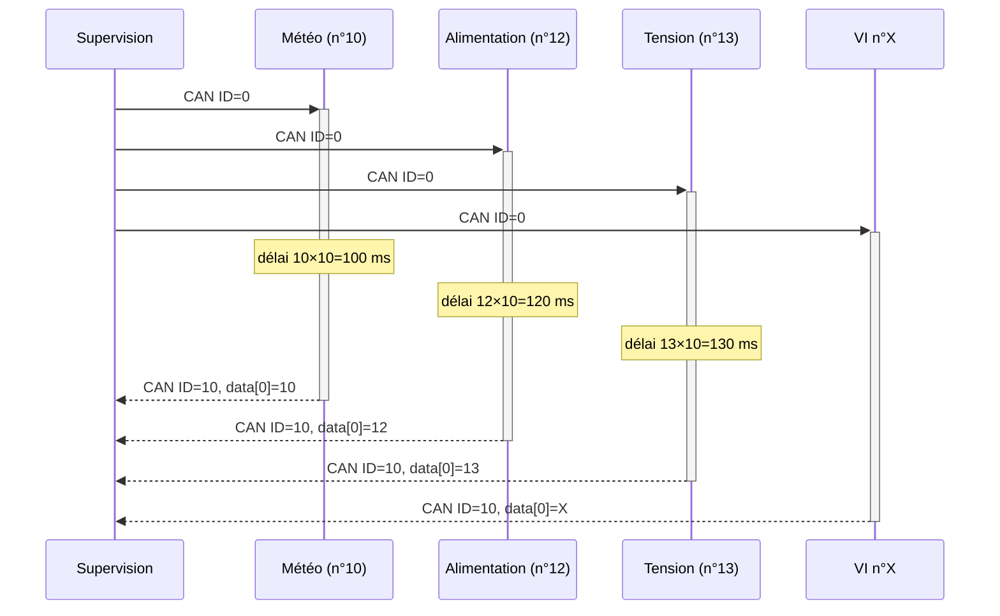
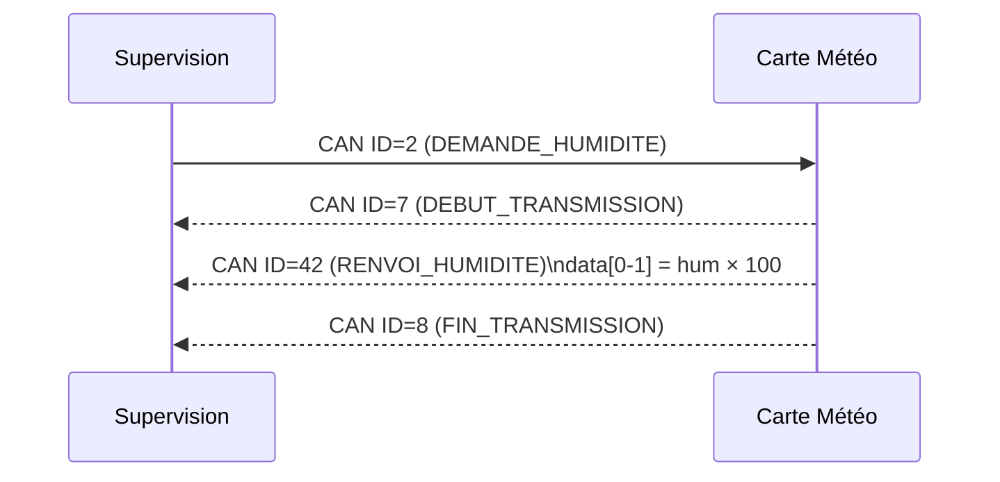
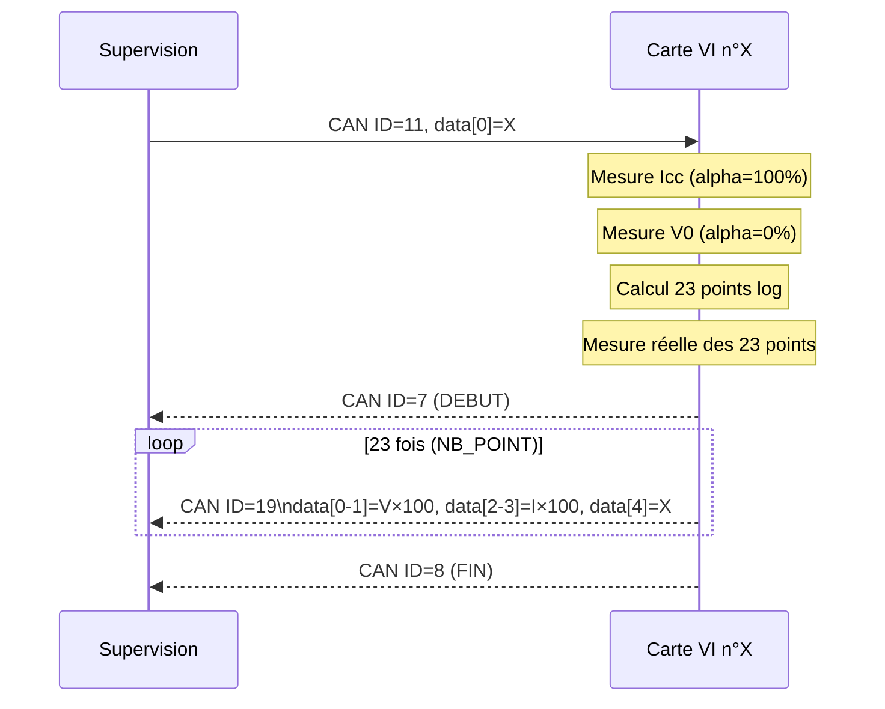

# Protocole CAN

## Paramètres physiques

| Paramètre | Valeur |
|-----------|--------|
| Vitesse | 10 kbps |
| Format | Standard (11 bits d'identifiant) |
| Résistances de terminaison | 120 Ω aux deux extrémités |
| Longueur de données max | 8 octets |

---

## Tableau complet des identifiants

| ID | Nom symbolique | Direction | Longueur | Description |
|----|----------------|-----------|----------|-------------|
| 0 | `CAN_ID_DEMANDE_NUM_CARTE` | Supervision → Toutes | 0 | Demande d'identification générale |
| 1 | `CAN_ID_DEMANDE_ALIMENTATION` | Supervision → Alim | 1 | `data[0]` : 1=allumer, 0=éteindre |
| 2 | `CAN_ID_DEMANDE_HUMIDITE` | Supervision → Météo | 0 | Demande humidité seule |
| 3 | `CAN_ID_DEMANDE_IRRADIANCE` | Supervision → Météo | 0 | Demande irradiance seule |
| 4 | `CAN_ID_DEMANDE_TEMP_EXTERIEUR` | Supervision → Météo | 0 | Demande température extérieure seule |
| 5 | `CAN_ID_DEMANDE_HUM_IRR_TEMP_EXT` | Supervision → Météo | 0 | Demande groupée (3 mesures) |
| 7 | `CAN_ID_DEBUT_TRANSMISSION` | Carte → Supervision | 0 | Marqueur début de séquence multi-trames |
| 8 | `CAN_ID_FIN_TRANSMISSION` | Carte → Supervision | 0 | Marqueur fin de séquence multi-trames |
| 10 | `CAN_ID_RENVOI_NUM_CARTE` | Toutes → Supervision | 1 | `data[0]` = numéro de la carte |
| 11 | `CAN_ID_DEMANDE_MESURE_VI` | Supervision → VI | 1 | `data[0]` = numéro de carte cible |
| 12 | `CAN_ID_DEMANDE_TEMP_PANNEAU` | Supervision → VI | 1 | `data[0]` = numéro de carte cible |
| 18 | `CAN_ID_RENVOI_TEMP_PANNEAU` | VI → Supervision | 3 | `data[0]`=signe, `data[1]`=valeur °C, `data[2]`=n° carte |
| 19 | `CAN_ID_RENVOI_MESURE_VI` | VI → Supervision | 5 | `data[0-1]`=tension×100, `data[2-3]`=courant×100, `data[4]`=n° carte |
| 42 | `CAN_ID_RENVOI_HUMIDITE` | Météo → Supervision | 2 | `data[0-1]` = humidité × 100 |
| 43 | `CAN_ID_RENVOI_TEMPERATURE` | Météo → Supervision | 2 | `data[0-1]` = température × 100 |
| 44 | `CAN_ID_RENVOI_IRRADIANCE` | Météo → Supervision | 2 | `data[0-1]` = irradiance × 100 |
| 45 | `CAN_ID_RENVOI_HUM_IRR_TEMP_EXT` | Météo → Supervision | 6 | `data[0-1]`=hum×100, `data[2-3]`=temp×100, `data[4-5]`=irr×100 |
| 50 | `CAN_ID_DEMANDE_TENSION_STRING` | Supervision → Tension | 1 | `data[0]` = numéro de string |
| 51 | `CAN_ID_RENVOI_TENSION_STRING` | Tension → Supervision | 3 | `data[0]`=indice, `data[1-2]`=valeur |
| 52 | `CAN_ID_DEMANDE_COURANT_STRING` | Supervision → Tension | 1 | `data[0]` = numéro de string |
| 53 | `CAN_ID_RENVOI_COURANT_STRING` | Tension → Supervision | 3 | – |

---

## Encodage des flottants

Toutes les valeurs physiques sont transmises sous forme d'entiers 16 bits non signés, en **big-endian**.

```
Encodage :
  entier = (int)(valeur_float × 100)
  data[n]   = entier >> 8         ← octet fort (MSB)
  data[n+1] = entier & 0xFF       ← octet faible (LSB)

Décodage :
  valeur_float = (data[n] * 256 + data[n+1]) / 100.0f
```

**Exemple** – Température de 23,45 °C :
```
entier    = 2345
data[0]   = 2345 / 256 = 9
data[1]   = 2345 % 256 = 41
Décodage  = (9 × 256 + 41) / 100.0 = 23.45 ✓
```

---

## Format détaillé des trames

### Réponse identification (ID=10)

```
+--------+--------+
| data[0]|        |
+--------+--------+
| n°carte|        |
+--------+--------+
Longueur : 1 octet
```

### Réponse mesure I-V (ID=19)

```
+--------+--------+--------+--------+--------+
| data[0]| data[1]| data[2]| data[3]| data[4]|
+--------+--------+--------+--------+--------+
|  Tension × 100  |  Courant × 100  | n°carte|
|   (16 bits BE)  |   (16 bits BE)  |        |
+--------+--------+--------+--------+--------+
Longueur : 5 octets
```

### Réponse groupée météo (ID=45)

```
+--------+--------+--------+--------+--------+--------+
| data[0]| data[1]| data[2]| data[3]| data[4]| data[5]|
+--------+--------+--------+--------+--------+--------+
| Humidité × 100  |Température × 100|Irradiance × 100 |
|   (16 bits BE)  |   (16 bits BE)  |   (16 bits BE)  |
+--------+--------+--------+--------+--------+--------+
Longueur : 6 octets
```

### Réponse température panneau (ID=18)

```
+--------+--------+--------+
| data[0]| data[1]| data[2]|
+--------+--------+--------+
|  Signe |  |T|°C | n°carte|
| 1=pos  |        |        |
| 0=neg  |        |        |
+--------+--------+--------+
Longueur : 3 octets
```

---

## Séquences de communication

### Séquence identification de toutes les cartes



### Séquence mesure météo individuelle (humidité)



### Séquence mesure courbe I-V



---

## Numéros de cartes

| Numéro | Carte |
|--------|-------|
| 1 à 5 | Cartes Mesure VI (lu sur DIP switch) |
| 10 | Carte Météo (fixe dans le firmware) |
| 12 | Carte Alimentation (fixe dans le firmware) |
| 13 | Carte Mesure Tension String (fixe dans le firmware) |
