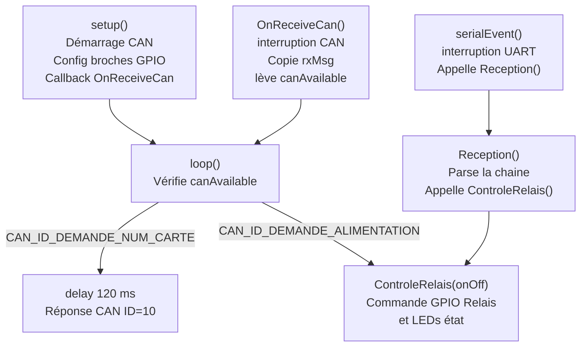

# Carte Alimentation

## Rôle

Contrôle le relais principal qui connecte ou déconnecte le panneau solaire du circuit. Deux LEDs indiquent l'état en temps réel.

---

## Matériel

| Composant | Broche GPIO | Rôle |
|-----------|:-----------:|------|
| Relais | 25 | Coupe ou rétablit l'alimentation du panneau |
| LED verte | 18 | Allumée = panneau alimenté (relais fermé) |
| LED rouge | 19 | Allumée = panneau coupé (relais ouvert) |
| Bus CAN | – | Réception des ordres et envoi du numéro de carte |

- **Numéro de carte :** 12 (fixe dans le firmware)
- **Vitesse CAN :** 10 kbps
- **FreeRTOS :** Non utilisé (architecture simple boucle `loop()`)

---

## Architecture logicielle



---

## Messages CAN traités

| ID reçu | Nom | Action |
|:-------:|-----|--------|
| 0 | `CAN_ID_DEMANDE_NUM_CARTE` | Attend 120 ms, répond ID=10 avec `data[0]=12` |
| 1 | `CAN_ID_DEMANDE_ALIMENTATION` | Appelle `ControleRelais(data[0])` |

---

## Commandes série (débogage)

| Commande | Effet |
|----------|-------|
| `R 1` | Ferme le relais (LED verte ON, LED rouge OFF) |
| `R 0` | Ouvre le relais (LED verte OFF, LED rouge ON) |

---

## Logique du relais

| `onOff` | Relais | LED verte | LED rouge | État panneau |
|:-------:|:------:|:---------:|:---------:|:------------:|
| 0 | Ouvert | OFF | ON | Coupé |
| 1 | Fermé | ON | OFF | Alimenté |

---

## Point d'attention

La callback `OnReceiveCan()` s'exécute dans une **interruption**. Elle ne fait que copier le message dans `rxMsg` et lever le drapeau `canAvailable`. Tout le traitement se fait dans `loop()` en dehors de l'interruption.

```cpp
// ISR – copie uniquement
void OnReceiveCan(int packetSize) {
    rxMsg.id  = CAN.packetId();
    // ... copie des données ...
    canAvailable = true;  // signal pour loop()
}

// loop() – traitement réel hors interruption
if (canAvailable == true) {
    canAvailable = false;
    // traitement du message
}
```
