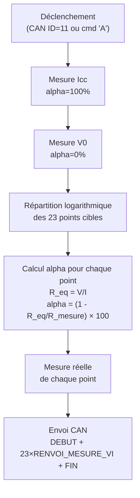

# Carte Mesure I-V

## Rôle

Mesure la **caractéristique courant-tension (I-V)** d'un panneau solaire photovoltaïque. En faisant varier la charge (via un PWM sur une résistance), on obtient une courbe I-V complète permettant de déterminer le point de puissance maximale (MPP).

Il peut exister **jusqu'à 5 cartes VI** sur le bus, numérotées de 1 à 5 via un DIP switch 4 bits.

---

## Matériel

| Composant | Interface | Broche GPIO | Rôle |
|-----------|-----------|:-----------:|------|
| DIP switch BP1–BP4 | GPIO INPUT | 25, 26, 27, 14 | Numéro de carte (bits 0 à 3) |
| Relais panneau | GPIO OUTPUT | 18 | Connexion/déconnexion du panneau |
| PWM charge | LEDC canal 0 | 19 | Rapport cyclique sur résistance de charge |
| ADC tension | ADC | GPIO 32 | Lecture tension panneau |
| ADC courant | ADC | GPIO 33 | Lecture courant panneau |
| TC74 | I2C (0x48) | SDA/SCL | Température du panneau |
| Bus CAN | – | – | Communication |

---

## Paramètres de mesure

| Paramètre | Valeur | Description |
|-----------|--------|-------------|
| `MOYENNE` | 100 | Nombre de lectures ADC moyennées par point |
| `R_mesure` | 22 Ω | Résistance de mesure du courant |
| `NB_POINT_V0_CONST` | 15 | Points côté tension constante (V0) |
| `NB_POINT_Icc_CONST` | 8 | Points côté courant constant (Icc) |
| `NB_POINT` | 23 | Total de points sur la courbe |
| `FREQUENCE` PWM | 50 000 Hz | Fréquence de la PWM |
| `RESOlUTION` PWM | 9 bits | Plage 0–511 |

---

## Tâches FreeRTOS

| Tâche | Priorité | Pile (octets) | Rôle |
|-------|:--------:|:-------------:|------|
| `TaskEnvoiMessageCan` | 10 | 2048 | Seul point d'écriture sur le bus CAN |
| `TaskTraitementMessageSerie` | 9 | 3072 | Interprète les commandes série |
| `TaskMesureCourbeVI` | 5 | 4096 | Trace la courbe complète (23 points) |
| `TaskMesurePointVI` | 5 | 3072 | Mesure un point à alpha fixé |
| `TaskMesureTemperatureTc74` | 5 | 3072 | Lecture température TC74 |
| `TaskEnvoiNumCarte` | 5 | 2048 | Répond aux demandes d'identification |

---

## Objets FreeRTOS

| Objet | Type | Capacité | Rôle |
|-------|------|:--------:|------|
| `flagsSystemeEvent` | Event Group | – | Événements CAN et série |
| `flagsMessageSerial` | Event Group | – | Signal réception série |
| `mutexSerialLink` | Mutex | – | Accès exclusif à `Serial.printf()` |
| `mutexCanLink` | Mutex | – | Accès exclusif à la file CAN |
| `balTxCanMsg` | Queue | 20 messages | Messages CAN à envoyer |
| `balRapportCyclique` | Queue | 10 points | Points I-V demandés par la tâche série |

---

## Bits d'événements

| Bit | Constante | Source | Tâche réveillée |
|-----|-----------|--------|-----------------|
| BIT1 | `FLAG_CAN_TEMPERATURE` | ISR CAN (ID=12, n°carte ciblé) | `TaskMesureTemperatureTc74` |
| BIT2 | `FLAG_CAN_VI_ALL` | ISR CAN (ID=11, n°carte ciblé) | `TaskMesureCourbeVI` |
| BIT3 | `FLAG_CAN_NUM_CARTE` | ISR CAN (ID=0) | `TaskEnvoiNumCarte` |
| BIT10 | `BIT_SERIAL_MSG` | ISR UART | `TaskTraitementMessageSerie` |
| BIT11 | `FLAG_SERIE_TEMPERATURE` | Tâche série (cmd "T") | `TaskMesureTemperatureTc74` |
| BIT12 | `FLAG_SERIE_VI_ALL` | Tâche série (cmd "A") | `TaskMesureCourbeVI` |

---

## Algorithme de mesure d'un point I-V (`MesureVI`)

```mermaid
flowchart LR
    A["Entrée:\npoint.alpha (0–100%)"] --> B["Fermer relais\ndigitalWrite HIGH"]
    B --> C["Appliquer PWM\nalpha/100 × 512"]
    C --> D["Attendre 100 ms\n(stabilisation)"]
    D --> E["Moyenner 100 lectures ADC\nTension + Courant"]
    E --> F["Calculer V et I bruts\nfacteur diviseur de tension"]
    F --> G["Ouvrir relais\ndigitalWrite LOW"]
    G --> H["Corriger non-linéarité\nV = V × (V×facteur + cste)\nI = I × (I×facteur + cste)"]
    H --> I["Sortie:\npoint.tension, point.courant"]
```



---

## Algorithme de la courbe I-V complète (`TaskMesureCourbeVI`)



### Répartition logarithmique des points

La distribution logarithmique concentre les points là où la courbe I-V varie le plus (aux extrémités) :

- **15 premiers points** (`i < NB_POINT_V0_CONST`) : tension fixée à V0, courant varie de V0.I vers Icc
- **8 derniers points** (`i >= NB_POINT_V0_CONST`) : courant fixé à Icc, tension varie de Icc.V vers V0

```
courant[i] = V0.I + (Icc.I - V0.I) × log10(1 + i×9 / (NB_POINT_V0_CONST - 1))
```

---

## Correction de non-linéarité

Chaque carte a ses propres coefficients de correction stockés dans des tableaux indexés par `numCarte - 1` :

```cpp
// Formule : mesure_corrigee = brut × (brut × facteur + constante)
tension = tensionBrute * (tensionBrute * facteurTension[numCarte-1] + constanteTension[numCarte-1]);
courant = courantBrut  * (courantBrut  * facteurCourant[numCarte-1] + constanteCourant[numCarte-1]);
```

| Carte n° | `facteurTension` | `constanteTension` | `facteurCourant` | `constanteCourant` |
|:--------:|:----------------:|:-----------------:|:---------------:|:-----------------:|
| 1 | -0.00806 | 1.13 | 0.00188 | 1.01 |
| 2 | -0.00126 | 1.210 | -0.0154 | 1.11 |
| 3 | -0.00847 | 1.14 | -0.0066 | 1.04 |
| 4 | -0.00955 | 1.6 | -0.0138 | 1.07 |
| 5 | -0.01900 | 1.31 | -0.00653 | 1.05 |

---

## Commandes série

| Commande | Exemple | Effet |
|----------|---------|-------|
| `M <alpha>` | `M 50.0` | Mesure un point I-V à alpha=50% |
| `A` | `A` | Déclenche la courbe I-V complète |
| `T` | `T` | Mesure la température du panneau |
