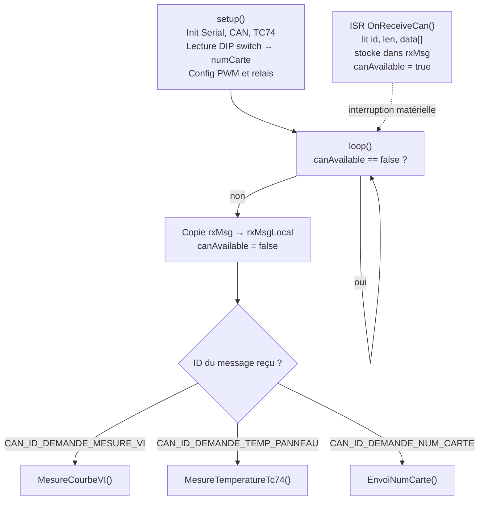
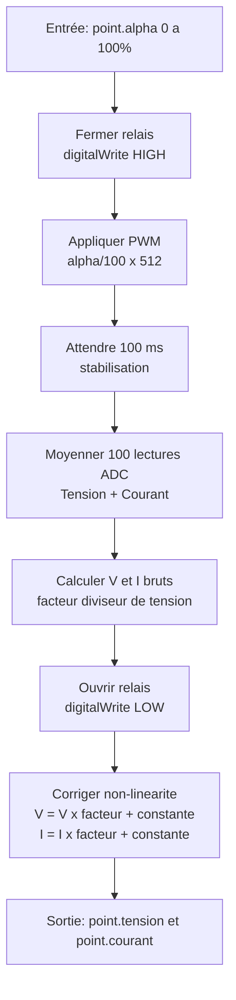
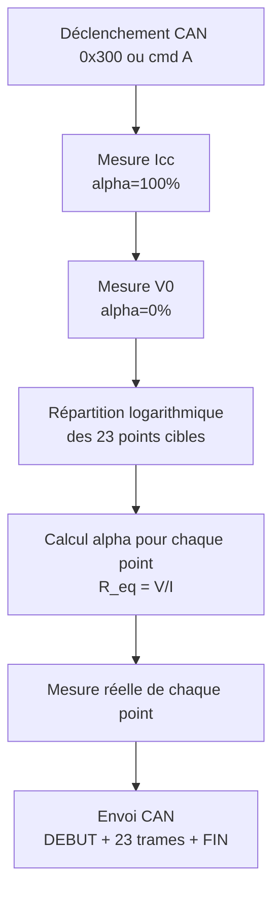

# Carte Mesure I-V

## Rôle

Mesure la **caractéristique courant-tension (I-V)** d'un panneau solaire photovoltaïque. En faisant varier la charge (via un PWM sur une résistance), on obtient une courbe I-V complète permettant de déterminer le point de puissance maximale (MPP).

Il peut exister **jusqu'à 5 cartes VI** sur le bus, numérotées de 1 à 5 via un DIP switch 4 bits.

---

## Matériel

| Composant | Interface | Broche GPIO | Rôle |
|-----------|-----------|:-----------:|------|
| DIP switch BP1 à BP4 | GPIO INPUT | 25, 26, 27, 14 | Numéro de carte (bits 0 à 3) |
| Relais panneau | GPIO OUTPUT | 18 | Connexion/déconnexion du panneau |
| PWM charge | LEDC canal 0 | 19 | Rapport cyclique sur résistance de charge |
| ADC tension | ADC | GPIO 32 | Lecture tension panneau |
| ADC courant | ADC | GPIO 33 | Lecture courant panneau |
| TC74 | I2C (0x48) | SDA/SCL | Température du panneau |
| Bus CAN | – | – | Communication |

---

## Paramètres de mesure

| Paramètre | Valeur | Description |
|-----------|:------:|-------------|
| `MOYENNE` | 100 | Nombre de lectures ADC moyennées par point |
| `R_mesure` | 22 Ohm | Résistance de mesure du courant |
| `NB_POINT_V0_CONST` | 15 | Points côté tension constante V0 |
| `NB_POINT_Icc_CONST` | 8 | Points côté courant constant Icc |
| `NB_POINT` | 23 | Total de points sur la courbe |
| Fréquence PWM | 50 000 Hz | Fréquence de la PWM |
| Résolution PWM | 9 bits | Plage 0 à 511 |

---

## Fonctionnement séquentiel

Le programme utilise le patron **ISR + flag** : l'interruption CAN stocke le message reçu et lève un drapeau ; `loop()` surveille ce drapeau et appelle la fonction de traitement correspondante.

---

## Algorithme de mesure d'un point I-V

---

## Algorithme de la courbe I-V complète

### Répartition logarithmique des points

La courbe est découpée en deux groupes. Dans chaque groupe, une grandeur reste fixe et l'autre progresse logarithmiquement.

**Groupe 1 — tension fixée à $V_0$** ($0 \le i < N_{V_0}$, soit 15 points) :

$$I[i] = I_{V_0} + (I_{cc} - I_{V_0}) \cdot \log_{10}\!\left(1 + \frac{i \times 9}{N_{V_0} - 1}\right)$$

**Groupe 2 — courant fixé à $I_{cc}$** ($N_{V_0} \le i < N_{total}$, soit 8 points) :

$$V[i] = V_{cc} + (V_0 - V_{cc}) \cdot \log_{10}\!\left(1 + \frac{(i - N_{V_0}) \times 9}{N_{cc} - 1}\right)$$

| Symbole | Constante | Valeur | Description |
|:-------:|-----------|:------:|-------------|
| $N_{V_0}$ | `NB_POINT_V0_CONST` | 15 | Nombre de points du groupe 1 |
| $N_{cc}$ | `NB_POINT_Icc_CONST` | 8 | Nombre de points du groupe 2 |
| $N_{total}$ | `NB_POINT` | 23 | Total de points sur la courbe |
| $(V_0,\, I_{V_0})$ | point `alpha=0` | – | Circuit ouvert (PWM 0 %) |
| $(V_{cc},\, I_{cc})$ | point `alpha=100` | – | Court-circuit (PWM 100 %) |

Le facteur 9 est choisi pour que $\log_{10}(1 + 9) = 1$, ce qui normalise la progression entre 0 et 1 dans les deux groupes.

---

## Correction de non-linéarité

Les ADC de l'ESP32 présentent une non-linéarité. Chaque mesure brute est corrigée par un polynôme du second degré sans terme constant :

$$V = V_{brut} \cdot (a_V \cdot V_{brut} + b_V)$$

$$I = I_{brut} \cdot (a_I \cdot I_{brut} + b_I)$$

| Symbole | Variable | Rôle |
|:-------:|----------|------|
| $a_V$ | `facteurTension[n-1]` | Coefficient quadratique tension |
| $b_V$ | `constanteTension[n-1]` | Coefficient linéaire tension |
| $a_I$ | `facteurCourant[n-1]` | Coefficient quadratique courant |
| $b_I$ | `constanteCourant[n-1]` | Coefficient linéaire courant |

Les coefficients sont étalonnés individuellement pour chaque carte ($n$ = numéro de carte) :

| N° carte | $a_V$ | $b_V$ | $a_I$ | $b_I$ |
|:--------:|:-----:|:-----:|:-----:|:-----:|
| 1 | -0.00806 | 1.13 | 0.00188 | 1.01 |
| 2 | -0.00126 | 1.210 | -0.0154 | 1.11 |
| 3 | -0.00847 | 1.14 | -0.0066 | 1.04 |
| 4 | -0.00955 | 1.6 | -0.0138 | 1.07 |
| 5 | -0.01900 | 1.31 | -0.00653 | 1.05 |

---

## Messages CAN traités

Le filtrage par `data[0] == numCarte` s'applique aux demandes `0x300` et `0x301` : la carte ignore les messages destinés à un autre numéro de carte.

| ID reçu | Nom | Condition | Action |
|:-------:|-----|-----------|--------|
| `0x020` | `CAN_ID_DEMANDE_NUM_CARTE` | – | Envoie `0x021` avec `data[0]=numCarte` |
| `0x300` | `CAN_ID_DEMANDE_MESURE_VI` | `data[0]==numCarte` | Appelle `MesureCourbeVI()`, émet `0x010` + 23×`0x380` + `0x011` |
| `0x301` | `CAN_ID_DEMANDE_TEMP_PANNEAU` | `data[0]==numCarte` | Appelle `MesureTemperatureTc74()`, émet `0x381` |

---

## Commandes série (débogage)

| Commande | Exemple | Effet |
|----------|---------|-------|
| `M <alpha>` | `M 50` | Mesure un point I-V à alpha=50 % et affiche tension/courant |
| `A` | `A` | Déclenche la courbe I-V complète et envoie les trames CAN |
| `T` | `T` | Mesure la température du panneau via TC74 et l'affiche |
