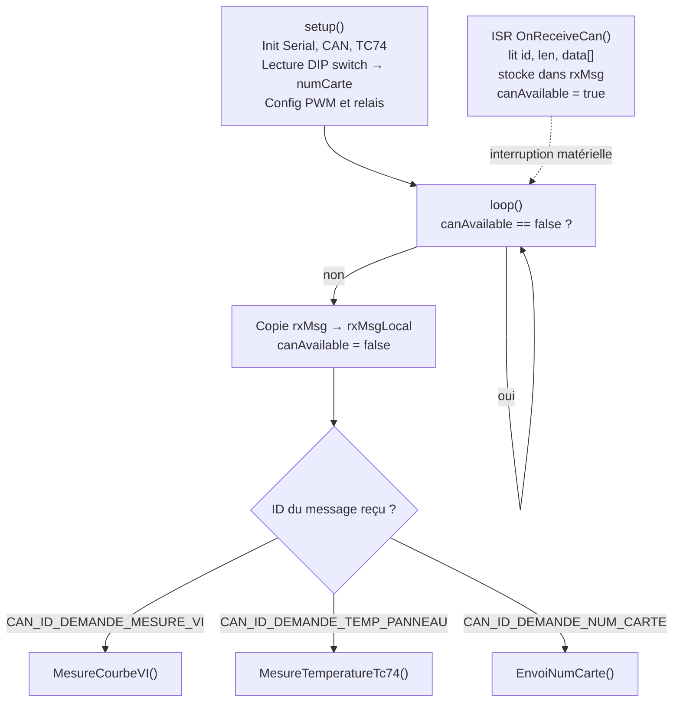
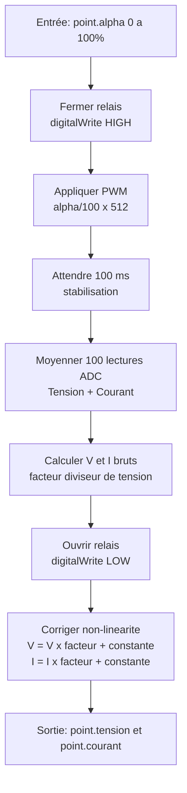
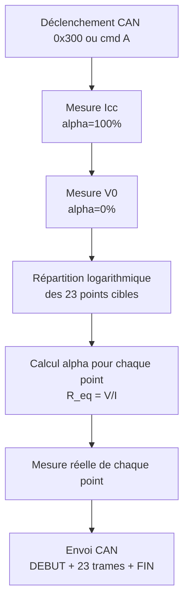

# Carte Mesure I-V

## Rôle

Mesure la **caractéristique courant-tension (I-V)** d'un panneau solaire photovoltaïque. En faisant varier la charge (via un PWM sur une résistance), on obtient une courbe I-V complète permettant de déterminer le point de puissance maximale (MPP).

Il peut exister **jusqu'à 5 cartes VI** sur le bus, numérotées de 1 à 5 via un DIP switch 4 bits.

---

## Matériel

| Composant | Interface | Broche GPIO | Rôle |
|-----------|-----------|:-----------:|------|
| DIP switch BP1 à BP4 | GPIO INPUT | 25, 26, 27, 14 | Numéro de carte (bits 0 à 3) |
| Relais panneau | GPIO OUTPUT | 18 | Connexion/déconnexion du panneau |
| PWM charge | LEDC canal 0 | 19 | Rapport cyclique sur résistance de charge |
| ADC tension | ADC | GPIO 32 | Lecture tension panneau |
| ADC courant | ADC | GPIO 33 | Lecture courant panneau |
| TC74 | I2C (0x48) | SDA/SCL | Température du panneau |
| Bus CAN | – | – | Communication |

---

## Paramètres de mesure

| Paramètre | Valeur | Description |
|-----------|:------:|-------------|
| `MOYENNE` | 100 | Nombre de lectures ADC moyennées par point |
| `R_mesure` | 22 Ohm | Résistance de mesure du courant |
| `NB_POINT_V0_CONST` | 15 | Points côté tension constante V0 |
| `NB_POINT_Icc_CONST` | 8 | Points côté courant constant Icc |
| `NB_POINT` | 23 | Total de points sur la courbe |
| Fréquence PWM | 50 000 Hz | Fréquence de la PWM |
| Résolution PWM | 9 bits | Plage 0 à 511 |

---

## Fonctionnement séquentiel

Le programme utilise le patron **ISR + flag** : l'interruption CAN stocke le message reçu et lève un drapeau ; `loop()` surveille ce drapeau et appelle la fonction de traitement correspondante.



---

## Algorithme de mesure d'un point I-V



---

## Algorithme de la courbe I-V complète



### Répartition logarithmique des points

La distribution logarithmique concentre les points là où la courbe I-V varie le plus (aux extrémités) :

- **15 premiers points** (`i < NB_POINT_V0_CONST`) : tension fixée à V0, courant varie de V0.I vers Icc
- **8 derniers points** (`i >= NB_POINT_V0_CONST`) : courant fixé à Icc, tension varie de Icc.V vers V0

```
courant[i] = V0.I + (Icc.I - V0.I) x log10(1 + i*9 / (NB_POINT_V0_CONST - 1))
```

---

## Correction de non-linéarité

Chaque carte a ses propres coefficients indexés par `numCarte - 1` :

```cpp
tension = tensionBrute * (tensionBrute * facteurTension[numCarte-1] + constanteTension[numCarte-1]);
courant = courantBrut  * (courantBrut  * facteurCourant[numCarte-1] + constanteCourant[numCarte-1]);
```

| N° carte | facteurTension | constanteTension | facteurCourant | constanteCourant |
|:--------:|:--------------:|:----------------:|:--------------:|:----------------:|
| 1 | -0.00806 | 1.13 | 0.00188 | 1.01 |
| 2 | -0.00126 | 1.210 | -0.0154 | 1.11 |
| 3 | -0.00847 | 1.14 | -0.0066 | 1.04 |
| 4 | -0.00955 | 1.6 | -0.0138 | 1.07 |
| 5 | -0.01900 | 1.31 | -0.00653 | 1.05 |

---

## Commandes série

| Commande | Exemple | Effet |
|----------|---------|-------|
| `M <alpha>` | `M 50.0` | Mesure un point I-V à alpha=50% |
| `A` | `A` | Déclenche la courbe I-V complète |
| `T` | `T` | Mesure la température du panneau |
