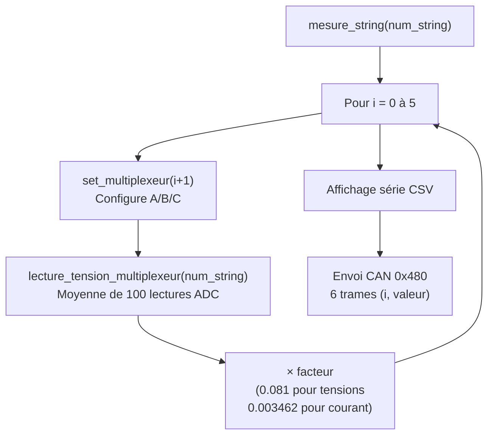

# Carte Mesure Tension String

## Rôle

Mesure les **tensions et le courant de chaque string** (branche) du champ solaire. Un multiplexeur 8:1 permet de lire jusqu'à 5 tensions et 1 courant via un seul canal ADC ESP32 par sortie multiplexeur.

- **Numéro de carte :** 13 (fixe dans le firmware)
- **Vitesse CAN :** 10 kbps

> **Note :** cette carte utilise encore une architecture FreeRTOS (une queue + une tâche d'envoi CAN). Elle sera convertie en séquentiel (patron ISR + flag) ultérieurement, comme les autres cartes.

---

## Matériel

| Composant | Interface | Broche GPIO | Rôle |
|-----------|-----------|:-----------:|------|
| Multiplexeur – sélection A | GPIO OUTPUT | 25 | Bit 0 de sélection canal |
| Multiplexeur – sélection B | GPIO OUTPUT | 33 | Bit 1 de sélection canal |
| Multiplexeur – sélection C | GPIO OUTPUT | 32 | Bit 2 de sélection canal |
| Sortie multiplexeur 1 | ADC | GPIO 36 | Lecture tension/courant string 1 |
| Sortie multiplexeur 2 | ADC | GPIO 39 | Lecture tension/courant string 2 |
| Sortie multiplexeur 3 | ADC | GPIO 34 | Lecture tension/courant string 3 |
| Sortie multiplexeur 4 | ADC | GPIO 35 | Lecture tension/courant string 4 |

---

## Canaux du multiplexeur

| Canal | A | B | C | Signal mesuré | Facteur |
|:-----:|:-:|:-:|:-:|---------------|:-------:|
| 1 | HIGH | HIGH | LOW | Tension string V1 | 0.081 |
| 2 | LOW | LOW | LOW | Tension string V2 | 0.081 |
| 3 | HIGH | LOW | LOW | Tension string V3 | 0.081 |
| 4 | LOW | HIGH | LOW | Tension string V4 | 0.081 |
| 5 | LOW | LOW | HIGH | Tension string V5 | 0.081 |
| 6 | LOW | LOW | HIGH | Courant string | 0.003462 |

> **Note :** Les canaux 5 et 6 ont la même configuration A/B/C dans le code actuel – cela semble être un point à corriger.

---

## Messages CAN traités

| ID reçu | Nom | Action |
|---------|-----|--------|
| `0x020` | `CAN_ID_DEMANDE_NUM_CARTE` | Envoie `0x021` avec `data[0]=13` |
| `0x400` | `CAN_ID_DEMANDE_TENSION_STRING` | Appelle `mesure_string(data[0])` |

---

## Fonctionnement de `mesure_string()`



---

## Format du message CAN de réponse (`0x480`)

```
Octet   : [0]      [1]        [2]
Champ   : indice   valeur MSB valeur LSB
```

Chaque trame transporte **une valeur** (index de 0 à 5) avec la valeur encodée sur 2 octets.

---

## Commandes série

| Commande | Exemple | Effet |
|----------|---------|-------|
| `R <n>` | `R 1` | Mesure le string n°1 |
| `N` | `N` | Envoie le numéro de carte |
