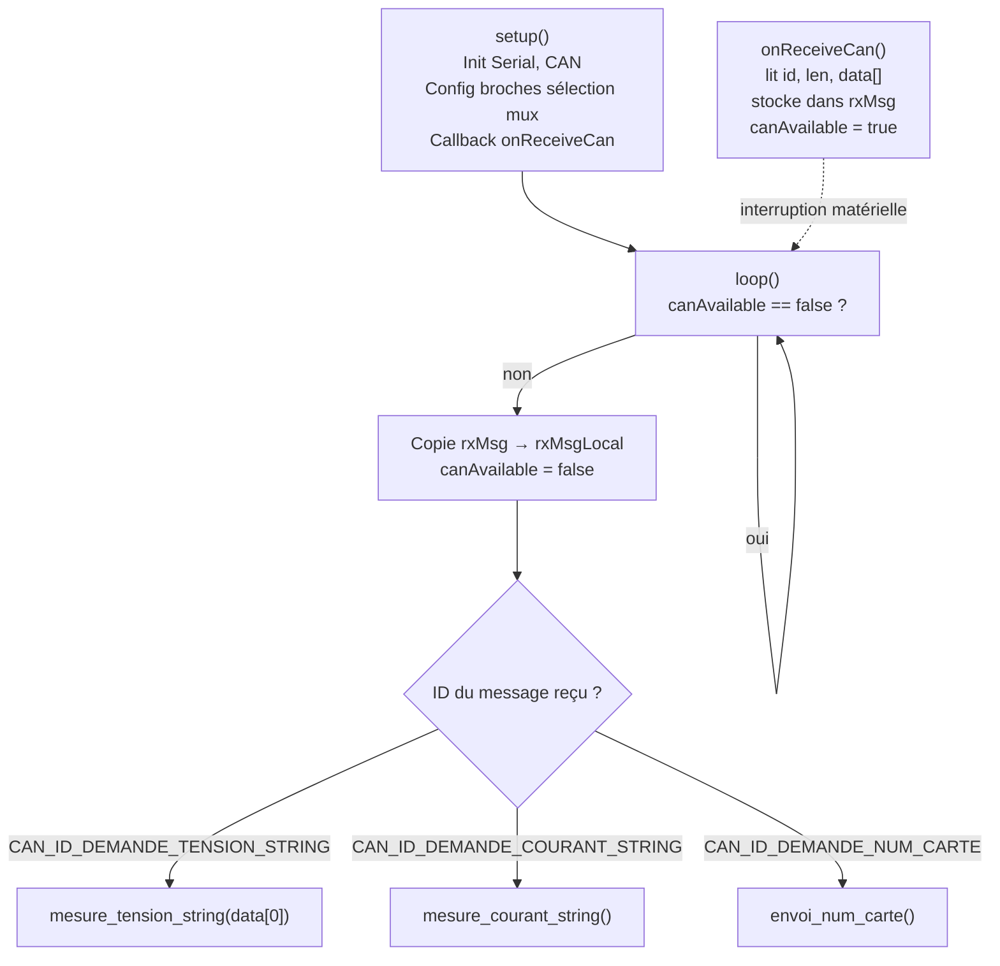
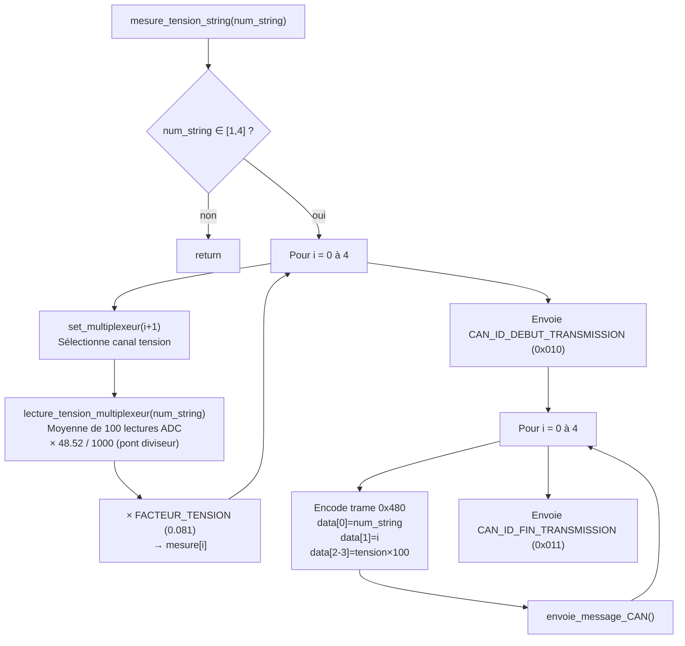
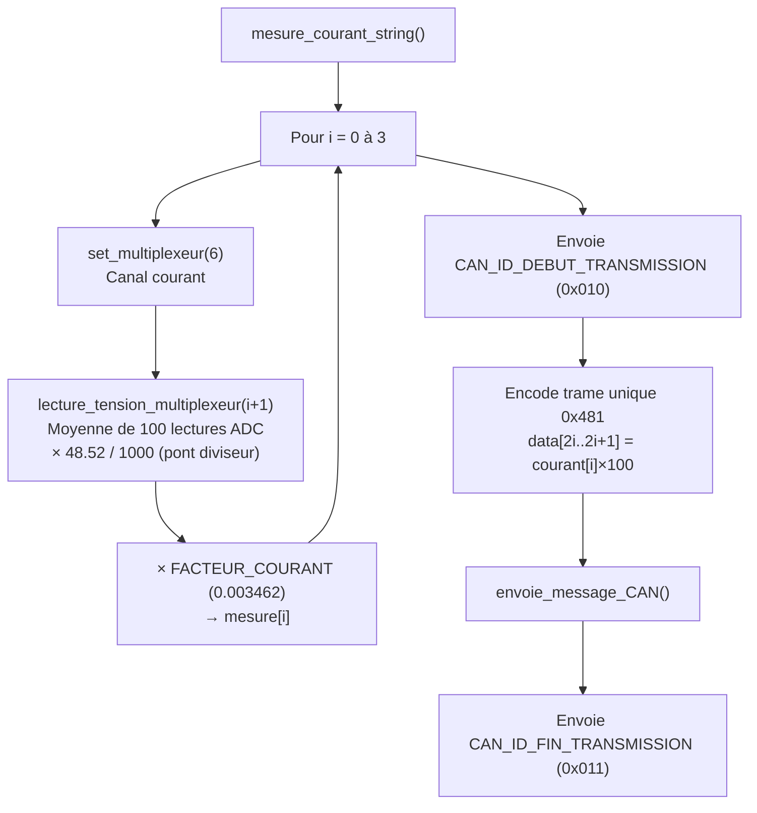

# Carte Mesure Tension String

## Rôle

Mesure les **tensions des 5 panneaux** de chacun des 4 **strings** (branches) du champ solaire, ainsi que le **courant** de chaque string. Un multiplexeur 8:1 (6 canaux utilisés) permet de partager les 4 entrées ADC de l'ESP32 entre les 5 tensions panneau et la mesure de courant.

- **Numéro de carte :** 13 (fixe dans le firmware)
- **Vitesse CAN :** 10 kbps

---

## Matériel

| Composant | Interface | Broche GPIO | Rôle |
|-----------|-----------|:-----------:|------|
| Multiplexeur – sélection A | GPIO OUTPUT | 25 | Bit 0 de sélection canal |
| Multiplexeur – sélection B | GPIO OUTPUT | 33 | Bit 1 de sélection canal |
| Multiplexeur – sélection C | GPIO OUTPUT | 32 | Bit 2 de sélection canal |
| Sortie multiplexeur string 1 | ADC | GPIO 36 | Lecture tension/courant string 1 |
| Sortie multiplexeur string 2 | ADC | GPIO 39 | Lecture tension/courant string 2 |
| Sortie multiplexeur string 3 | ADC | GPIO 34 | Lecture tension/courant string 3 |
| Sortie multiplexeur string 4 | ADC | GPIO 35 | Lecture tension/courant string 4 |
| Bus CAN | – | – | Communication avec la supervision |

---

## Canaux du multiplexeur

Les 3 broches de sélection (A, B, C) choisissent la grandeur à présenter sur chacune des 4 sorties ADC :

| Canal | A | B | C | Grandeur mesurée | Facteur appliqué |
|:-----:|:-:|:-:|:-:|------------------|:----------------:|
| 1 | HIGH | HIGH | LOW  | Tension panneau 1 | `FACTEUR_TENSION` = 0.081 |
| 2 | LOW  | LOW  | LOW  | Tension panneau 2 | `FACTEUR_TENSION` = 0.081 |
| 3 | HIGH | LOW  | LOW  | Tension panneau 3 | `FACTEUR_TENSION` = 0.081 |
| 4 | LOW  | HIGH | LOW  | Tension panneau 4 | `FACTEUR_TENSION` = 0.081 |
| 5 | LOW  | LOW  | HIGH | Tension panneau 5 | `FACTEUR_TENSION` = 0.081 |
| 6 | HIGH | LOW  | HIGH | Courant du string | `FACTEUR_COURANT` = 0.003462 |

---

## Fonctionnement séquentiel

Le programme utilise le patron **ISR + flag** : l'interruption CAN copie le message reçu et lève un drapeau ; `loop()` surveille ce drapeau et appelle la fonction de mesure correspondante.



---

## Messages CAN traités

| ID reçu | Nom | Action |
|:-------:|-----|--------|
| `0x020` | `CAN_ID_DEMANDE_NUM_CARTE` | Envoie `0x021` avec `data[0] = 13` |
| `0x400` | `CAN_ID_DEMANDE_TENSION_STRING` | Mesure les 5 tensions du string `data[0]` (1 à 4) |
| `0x401` | `CAN_ID_DEMANDE_COURANT_STRING` | Mesure les courants des 4 strings |

---

## Mesure des tensions d'un string – `mesure_tension_string()`

Pour le string demandé (1 à 4), la fonction balaie les canaux 1 à 5 du multiplexeur, lit chaque tension panneau (moyenne de 100 lectures ADC), applique `FACTEUR_TENSION`, puis envoie **5 trames** `0x480` encadrées par les marqueurs de rafale.



### Format du message `0x480` (`CAN_ID_RENVOI_TENSION_STRING`, DLC = 4)

| Octet | data[0] | data[1] | data[2] | data[3] |
|-------|---------|---------|---------|---------|
| Contenu | N° string | N° panneau | Tension MSB | Tension LSB |
| Valeur | 1 à 4 | 0 à 4 | Tension × 100 (big-endian) | |

---

## Mesure des courants des 4 strings – `mesure_courant_string()`

La fonction sélectionne le canal 6 du multiplexeur et lit successivement les 4 ADC (un par string), applique `FACTEUR_COURANT`, puis envoie **une seule trame** `0x481` de 8 octets encadrée par les marqueurs de rafale.



### Format du message `0x481` (`CAN_ID_RENVOI_COURANT_STRING`, DLC = 8)

| Octet | data[0] | data[1] | data[2] | data[3] | data[4] | data[5] | data[6] | data[7] |
|-------|---------|---------|---------|---------|---------|---------|---------|---------|
| Contenu | I1 MSB | I1 LSB | I2 MSB | I2 LSB | I3 MSB | I3 LSB | I4 MSB | I4 LSB |
| Valeur | Courant string 1 × 100 | | Courant string 2 × 100 | | Courant string 3 × 100 | | Courant string 4 × 100 | |

---

## Chaîne de conversion ADC → grandeur physique

```
analogReadMilliVolts(pin)               → mV mesurés par l'ESP32 sur la sortie mux
× (48.52 / 1000)                        → tension réelle (V) après pont diviseur externe
× FACTEUR_TENSION (0.081)               → tension panneau finale (canaux 1–5)
× FACTEUR_COURANT (0.003462)            → courant string final (canal 6)
```

La moyenne sur `MOYENNAGE = 100` lectures est effectuée dans `lecture_tension_multiplexeur()` avant l'application des facteurs ci-dessus.

---

## Commandes série (débogage)

| Commande | Exemple | Effet |
|----------|---------|-------|
| `R <n>` | `R 1` | Mesure et affiche les 5 tensions du string `n` (1 à 4), envoie également les trames CAN |
| `T` | `T` | Mesure et affiche les courants des 4 strings, envoie également la trame CAN |
| `N` | `N` | Envoie le numéro de carte sur le bus CAN |

---

## Point d'attention

La callback `onReceiveCan()` s'exécute dans une **interruption**. Elle ne fait que copier le message dans `rxMsg` et lever le drapeau `canAvailable`. Tout le traitement (mesures ADC, envoi CAN, écriture série) se fait dans `loop()` en dehors de l'interruption.

```cpp
// ISR – copie uniquement
void onReceiveCan(int packetSize) {
    rxMsg.id  = CAN.packetId();
    // ... copie des données ...
    canAvailable = true;  // signal pour loop()
}

// loop() – traitement réel hors interruption
if (canAvailable == true) {
    rxMsgLocal = rxMsg;
    // dispatch selon rxMsgLocal.id
    canAvailable = false;
}
```
