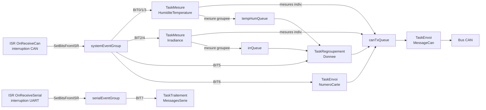

# Carte Météo

## Rôle

Mesure les conditions environnementales autour du panneau solaire : **température extérieure**, **humidité relative** et **irradiance solaire**. Elle peut envoyer chaque grandeur séparément ou les trois regroupées dans un seul message CAN.

---

## Matériel

| Composant | Interface | Broche / Adresse | Grandeur mesurée |
|-----------|-----------|:----------------:|-----------------|
| AM2315 | I2C | Adresse par défaut | Température + Humidité |
| Cellule photoélectrique | ADC | GPIO 34 | Irradiance solaire |
| Bus CAN | – | – | Communication |

- **Numéro de carte :** 10 (fixe dans le firmware)
- **Vitesse CAN :** 10 kbps
- **FreeRTOS :** Oui – 6 tâches

---

## Objets FreeRTOS

| Objet | Type | Capacité | Rôle |
|-------|------|:--------:|------|
| `systemEventGroup` | Event Group | – | Réveille les tâches selon le type de demande CAN |
| `serialEventGroup` | Event Group | – | Signale la réception d'un caractère série |
| `serialMutex` | Mutex | – | Accès exclusif à `Serial.printf()` |
| `canTxQueue` | Queue | 5 msg | File des messages CAN à envoyer |
| `tempHumQueue` | Queue | 3 elem | Partage temp+hum vers `TaskRegroupementDonnee` |
| `irrQueue` | Queue | 3 elem | Partage irradiance vers `TaskRegroupementDonnee` |

---

## Bits d'événements

| Bit | Constante | Levé par | Attendu par |
|:---:|-----------|----------|-------------|
| BIT0 | `EVENT_TEMP` | `OnReceiveCan` ID=4 | `TaskMesureHumiditeTemperature` |
| BIT1 | `EVENT_HUM` | `OnReceiveCan` ID=2 | `TaskMesureHumiditeTemperature` |
| BIT2 | `EVENT_IRR` | `OnReceiveCan` ID=3 | `TaskMesureIrradiance` |
| BIT3 | `EVENT_ALL_TEMP_HUM` | `OnReceiveCan` ID=5 | `TaskMesureHumiditeTemperature` |
| BIT4 | `EVENT_ALL_IRR` | `OnReceiveCan` ID=5 | `TaskMesureIrradiance` |
| BIT5 | `EVENT_ALL_REG` | `OnReceiveCan` ID=5 | `TaskRegroupementDonnee` |
| BIT6 | `EVENT_CARD_NUM` | `OnReceiveCan` ID=0 | `TaskEnvoiNumeroCarte` |
| BIT7 | `EVENT_SERIAL_MSG_RX` | `OnReceiveSerial` | `TaskTraitementMessagesSerie` |

---

## Tâches FreeRTOS

| Tâche | Priorité | Pile (octets) | Événement attendu | Sortie |
|-------|:--------:|:-------------:|-------------------|--------|
| `TaskEnvoiMessageCan` | 10 | 3072 | `canTxQueue` bloquant | CAN bus |
| `TaskTraitementMessagesSerie` | 10 | 2048 | `EVENT_SERIAL_MSG_RX` | `systemEventGroup` |
| `TaskMesureHumiditeTemperature` | 9 | 2048 | `EVENT_HUM / TEMP / ALL_TH` | `canTxQueue` ou `tempHumQueue` |
| `TaskMesureIrradiance` | 9 | 2048 | `EVENT_IRR / ALL_IRR` | `canTxQueue` ou `irrQueue` |
| `TaskRegroupementDonnee` | 9 | 2048 | `EVENT_ALL_REG` | `canTxQueue` |
| `TaskEnvoiNumeroCarte` | 9 | 2048 | `EVENT_CARD_NUM` | `canTxQueue` |

---

## Diagramme de flux FreeRTOS



---

## Encodage des mesures

La mesure flottante est multipliée par 100 et stockée sur 2 octets big-endian :

```c
humidityInt   = humidity * 100;
data[0] = humidityInt / 256;   // octet fort
data[1] = humidityInt % 256;   // octet faible
```

En cas d'échec de lecture du capteur AM2315 (`isnan()`), la tâche effectue de nouvelles tentatives en boucle jusqu'à obtenir une valeur valide.

---

## Format du message groupé (ID=45)

| Octets | Contenu | Encodage |
|:------:|---------|----------|
| data[0-1] | Humidité | humidité × 100, 16 bits BE |
| data[2-3] | Température | température × 100, 16 bits BE |
| data[4-5] | Irradiance | irradiance × 100, 16 bits BE |

En cas de timeout (2 s pour irradiance, 5 s pour temp+hum), les octets correspondants sont mis à `0xFF`.
