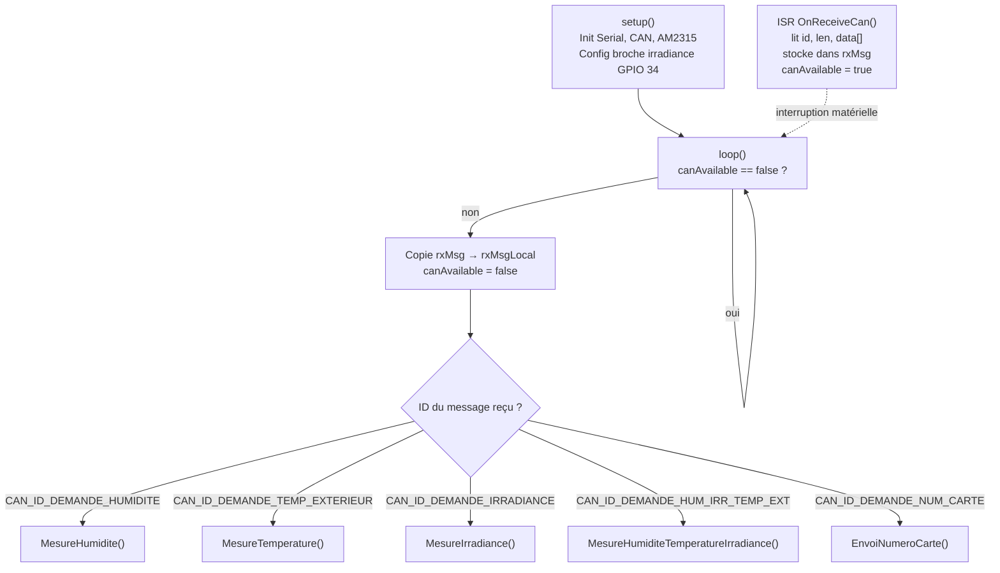

# Carte Météo

## Rôle

Mesure les conditions environnementales autour du panneau solaire : **température extérieure**, **humidité relative** et **irradiance solaire**. Elle peut envoyer chaque grandeur séparément ou les trois regroupées dans un seul message CAN.

---

## Matériel

| Composant | Interface | Broche / Adresse | Grandeur mesurée |
|-----------|-----------|:----------------:|-----------------|
| AM2315 | I2C | Adresse par défaut | Température + Humidité |
| Cellule photoélectrique | ADC | GPIO 34 | Irradiance solaire |
| Bus CAN | – | – | Communication |

- **Numéro de carte :** 10 (fixe dans le firmware)
- **Vitesse CAN :** 10 kbps

---

## Fonctionnement séquentiel

Le programme utilise le patron **ISR + flag** : l'interruption CAN stocke le message reçu et lève un drapeau ; `loop()` surveille ce drapeau et appelle la fonction de mesure correspondante.



---

## Encodage des mesures

La mesure flottante est multipliée par 100 et stockée sur 2 octets big-endian :

```c
humidityInt   = humidity * 100;
data[0] = humidityInt / 256;   // octet fort
data[1] = humidityInt % 256;   // octet faible
```

---

## Format du message groupé (ID=45)

| Octets | Contenu | Encodage |
|:------:|---------|----------|
| data[0-1] | Humidité | humidité × 100, 16 bits BE |
| data[2-3] | Température | température × 100, 16 bits BE |
| data[4-5] | Irradiance | irradiance × 100, 16 bits BE |
