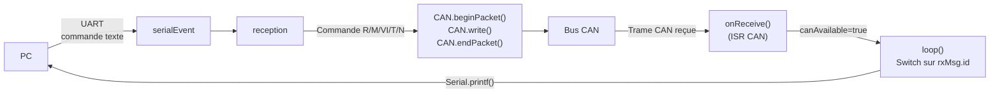

# Carte Supervision

## Rôle

La carte supervision est l'**interface entre le PC de contrôle et le bus CAN**. Elle reçoit des commandes textuelles sur sa liaison série (UART), les traduit en trames CAN vers les cartes esclaves, et retransmet les réponses CAN vers le PC dans un format lisible.

---

## Architecture

```
PC ──(UART 115200)──► Carte Supervision ──(CAN 10kbps)──► Toutes les cartes
```

La carte ne fait **aucun traitement des données** : elle est un pur relais bidirectionnel.

---

## Commandes série (débogage)

Ces commandes sont envoyées par le PC sur l'UART (115 200 baud) et traduites en trames CAN par la carte supervision.

| Commande | Trame CAN émise | Description |
|----------|----------------|-------------|
| `R 1` | `0x100`, `data[0]=1` | Ferme le relais alimentation |
| `R 0` | `0x100`, `data[0]=0` | Ouvre le relais alimentation |
| `M` | `0x200` | Demande mesure météo groupée (hum + temp + irr) |
| `VI <n>` | `0x300`, `data[0]=n` | Demande courbe I-V de la carte n |
| `T <n>` | `0x301`, `data[0]=n` | Demande température panneau de la carte n |
| `N` | `0x020` | Demande d'identification de toutes les cartes |
| `V <n>` | `0x400`, `data[0]=n` | Demande les tensions du string n (1 à 4) |
| `C` | `0x401` | Demande les courants des 4 strings |

---

## Messages CAN traités

La carte supervision reçoit les réponses des cartes esclaves et les retransmet sur le port série vers le PC.

| ID CAN reçu | Nom | Format série envoyé | Signification |
|:-----------:|-----|---------------------|---------------|
| `0x010` | `CAN_ID_DEBUT_TRANSMISSION` | `"0\r\n"` | Début de rafale multi-trames |
| `0x011` | `CAN_ID_FIN_TRANSMISSION` | `"9999\r\n"` | Fin de rafale multi-trames |
| `0x021` | `CAN_ID_RENVOI_NUM_CARTE` | `"0;n\r\n"` | Carte n°n présente sur le bus |
| `0x280` | `CAN_ID_RENVOI_HUM_IRR_TEMP_EXT` | `"10;H;T;I\r\n"` | Hum (%), Temp (°C), Irr groupés |
| `0x281` | `CAN_ID_RENVOI_HUMIDITE` | `"11;H\r\n"` | Humidité H % |
| `0x282` | `CAN_ID_RENVOI_TEMPERATURE` | `"12;T\r\n"` | Température ext. T °C |
| `0x283` | `CAN_ID_RENVOI_IRRADIANCE` | `"13;I\r\n"` | Irradiance I |
| `0x380` | `CAN_ID_RENVOI_MESURE_VI` | `"1;n;V;I\r\n"` | V (V), I (A), carte n°n |
| `0x381` | `CAN_ID_RENVOI_TEMP_PANNEAU` | `"2;n;T\r\n"` | Température T °C, carte n°n |
| `0x480` | `CAN_ID_RENVOI_TENSION_STRING` | `"20;s;p;V\r\n"` | Tension V (V), string s, panneau p |
| `0x481` | `CAN_ID_RENVOI_COURANT_STRING` | `"21;I1;I2;I3;I4\r\n"` | Courants des 4 strings (A) |

---

## Diagramme de flux



---

## Décodage des valeurs dans la réponse

La carte supervision décode les flottants encodés sur 2 octets :

```cpp
// Exemple pour RENVOI_MESURE_VI (0x380)
tension = (rxMsg.data[0] * 256 + rxMsg.data[1]) / 100.0f;
courant = (rxMsg.data[2] * 256 + rxMsg.data[3]) / 100.0f;
```
