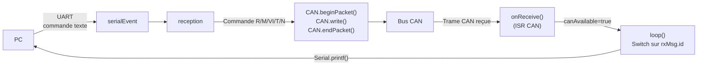

# Carte Supervision

## Rôle

La carte supervision est l'**interface entre le PC de contrôle et le bus CAN**. Elle reçoit des commandes textuelles sur sa liaison série (UART), les traduit en trames CAN vers les cartes esclaves, et retransmet les réponses CAN vers le PC dans un format lisible.

---

## Architecture

```
PC ──(UART 115200)──► Carte Supervision ──(CAN 10kbps)──► Toutes les cartes
```

La carte ne fait **aucun traitement des données** : elle est un pur relais bidirectionnel.

---

## Commandes série envoyées vers le bus CAN

| Commande | Trame CAN émise | Description |
|----------|----------------|-------------|
| `R 1` | `0x100`, `data[0]=1` | Allume le relais alimentation |
| `R 0` | `0x100`, `data[0]=0` | Éteint le relais alimentation |
| `M` | `0x200` | Demande mesure météo groupée |
| `VI <n>` | `0x300`, `data[0]=n` | Demande courbe I-V de la carte n |
| `T <n>` | `0x301`, `data[0]=n` | Demande température panneau de la carte n |
| `N` | `0x020` | Demande d'identification de toutes les cartes |

---

## Format des réponses renvoyées vers le PC

| ID CAN reçu | Format série envoyé | Signification |
|-------------|---------------------|---------------|
| `0x010` (DEBUT) | `"0\r\n"` | Début de séquence |
| `0x011` (FIN) | `"99\r\n"` | Fin de séquence |
| `0x021` (NUM_CARTE) | `"0;n\r\n"` | Carte n°n présente sur le bus |
| `0x280` (HUM_IRR_TEMP_EXT) | `"10;H;T;I\r\n"` | Hum, Temp, Irr regroupés |
| `0x281` (HUMIDITE) | `"11;H\r\n"` | Humidité H % |
| `0x282` (TEMPERATURE) | `"12;T\r\n"` | Température ext. T °C |
| `0x283` (IRRADIANCE) | `"13;I\r\n"` | Irradiance I |
| `0x380` (MESURE_VI) | `"1;n;V;I\r\n"` | V volts, I ampères, carte n°n |
| `0x381` (TEMP_PANNEAU) | `"2;n;T\r\n"` | Température T °C, carte n°n |

---

## Diagramme de flux



---

## Décodage des valeurs dans la réponse

La carte supervision décode les flottants encodés sur 2 octets :

```cpp
// Exemple pour RENVOI_MESURE_VI (0x380)
tension = (rxMsg.data[0] * 256 + rxMsg.data[1]) / 100.0f;
courant = (rxMsg.data[2] * 256 + rxMsg.data[3]) / 100.0f;
```
