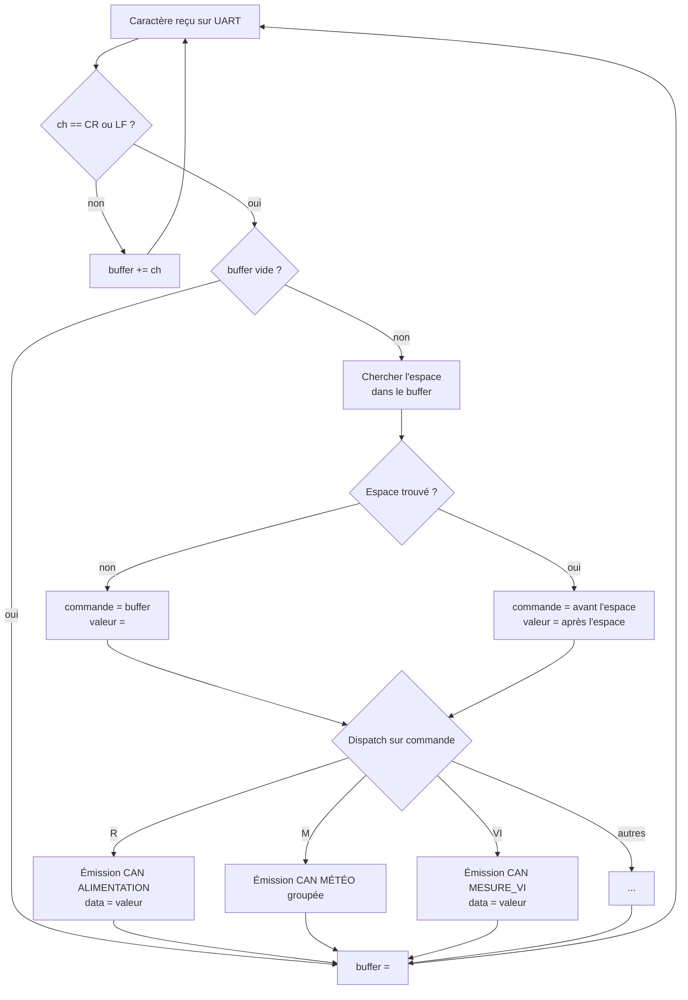
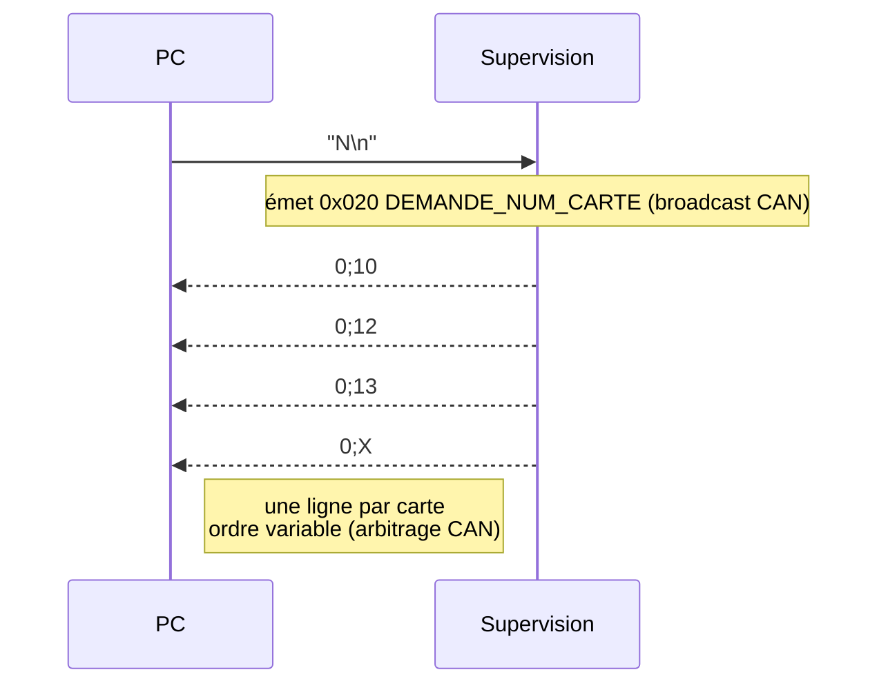
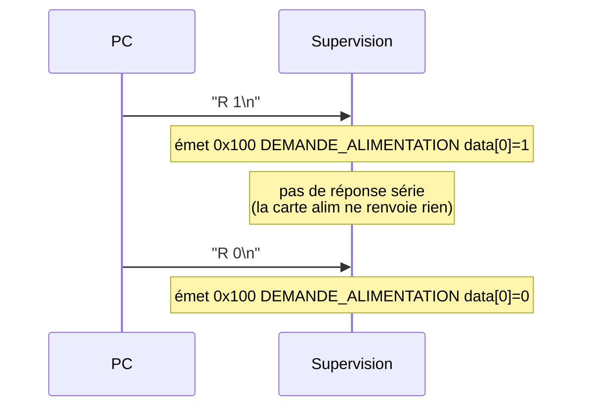
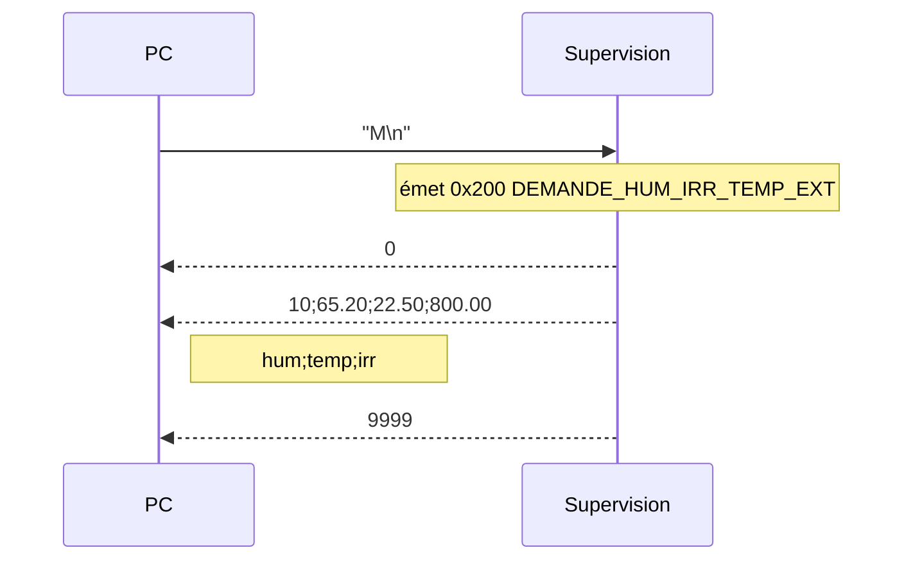
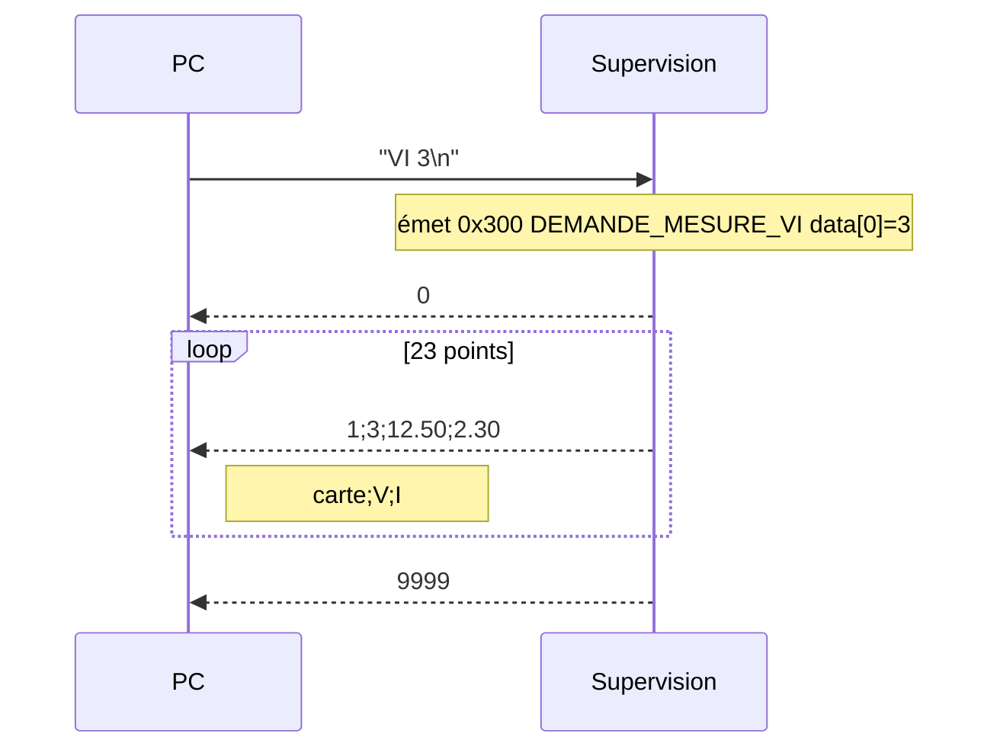
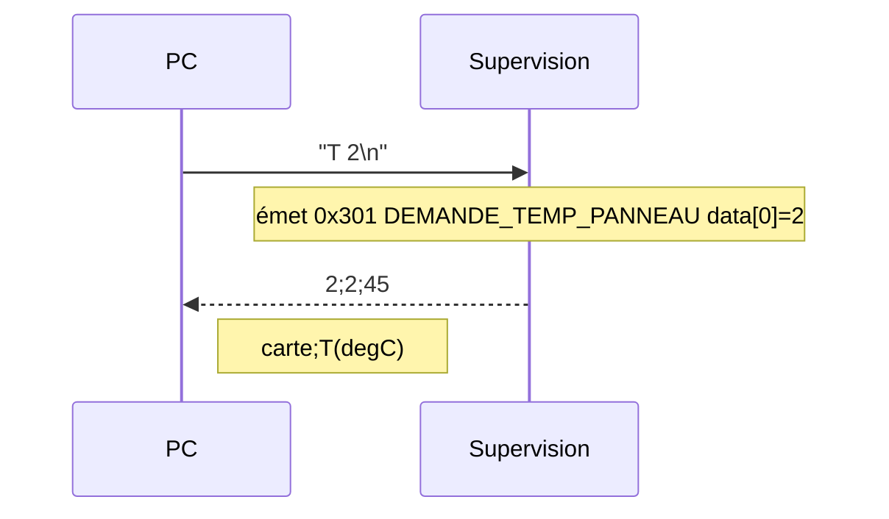
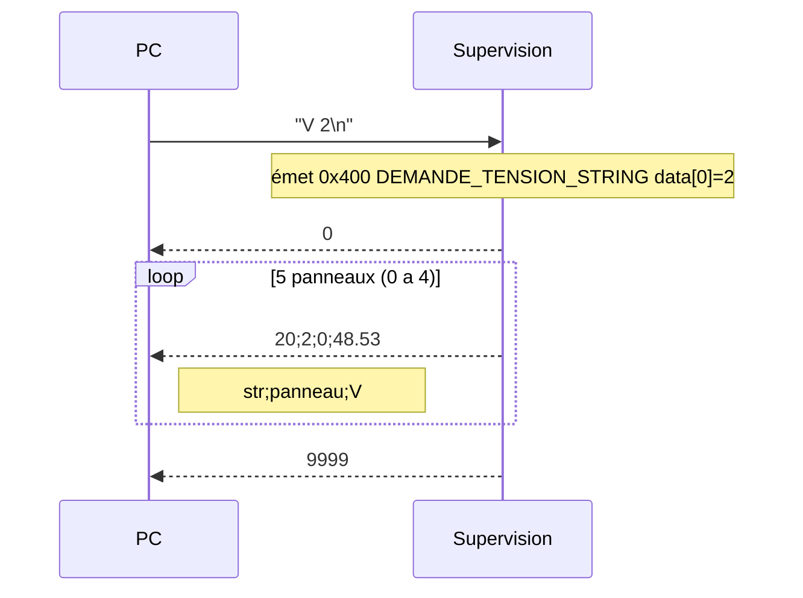
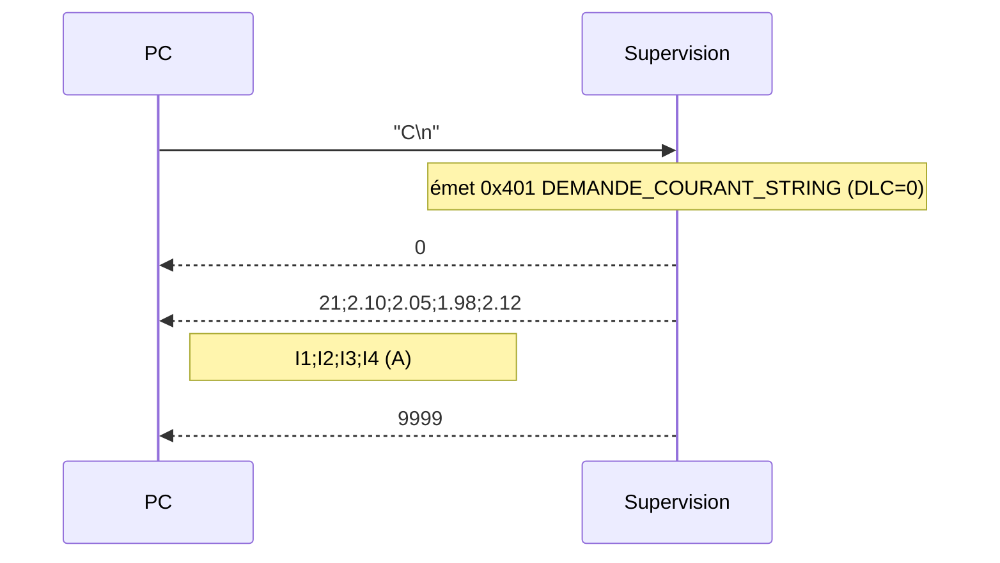
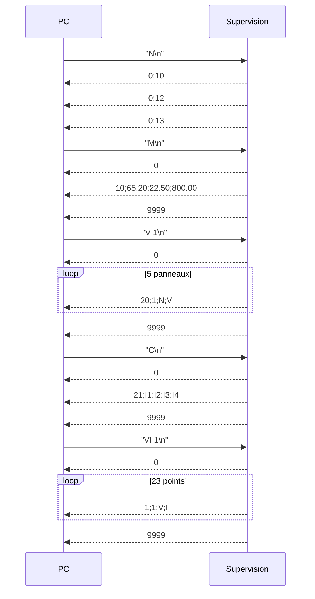

# Protocole Série

## Paramètres physiques

| Paramètre | Valeur |
|-----------|--------|
| Débit | 115200 bauds |
| Bits de données | 8 |
| Parité | Aucune |
| Bits de stop | 1 |
| Contrôle de flux | Aucun |

---

## Format général

### Commandes envoyées (PC → Carte)

```
COMMANDE [VALEUR]\r\n
```

- `COMMANDE` : chaîne ASCII sans espace (ex. `R`, `VI`, `M`)
- `VALEUR` : entier optionnel séparé par un espace
- Délimiteur de fin : CR (`\r`, ASCII 13) **ou** LF (`\n`, ASCII 10)

### Réponses reçues (Supervision → PC)

```
CODE;VALEUR1;VALEUR2;...\r\n
```

- Séparateur : point-virgule `;`
- Valeurs numériques : entiers ou flottants selon le type
- Une ligne par événement CAN reçu

---

## Protocole de la carte Supervision

La Supervision est l'unique point d'accès série du système côté PC. Elle traduit les commandes série en trames CAN (PC → CAN) et les trames CAN reçues en lignes CSV (CAN → PC).

### Commandes PC → Supervision

| Commande | Exemple | Trame CAN émise | Description |
|----------|---------|-----------------|-------------|
| `R <0\|1>` | `R 1` | `0x100` DEMANDE_ALIMENTATION | Contrôle le relais : 1=fermer, 0=ouvrir |
| `M` | `M` | `0x200` DEMANDE_HUM_IRR_TEMP_EXT | Demande météo groupée |
| `VI <n>` | `VI 3` | `0x300` DEMANDE_MESURE_VI | Demande courbe I-V de la carte n |
| `T <n>` | `T 2` | `0x301` DEMANDE_TEMP_PANNEAU | Demande température panneau de la carte n |
| `N` | `N` | `0x020` DEMANDE_NUM_CARTE | Demande identification de toutes les cartes |
| `V <n>` | `V 2` | `0x400` DEMANDE_TENSION_STRING | Demande les 5 tensions du string n (1–4) |
| `C` | `C` | `0x401` DEMANDE_COURANT_STRING | Demande les courants des 4 strings |

### Réponses Supervision → PC

| Code CSV | Exemple | Source CAN | Description |
|----------|---------|------------|-------------|
| `0` | `0` | `0x010` DEBUT_TRANSMISSION | Début de rafale multi-trames |
| `9999` | `9999` | `0x011` FIN_TRANSMISSION | Fin de rafale multi-trames |
| `0;<n>` | `0;12` | `0x021` RENVOI_NUM_CARTE | Identification : n° de carte |
| `1;<carte>;<V>;<I>` | `1;3;12.50;2.30` | `0x380` RENVOI_MESURE_VI | Point I-V de la carte n |
| `2;<carte>;<T>` | `2;1;45` | `0x381` RENVOI_TEMP_PANNEAU | Température panneau (°C entier) de la carte n |
| `10;<hum>;<temp>;<irr>` | `10;65.20;22.50;800.00` | `0x280` RENVOI_HUM_IRR_TEMP_EXT | Météo groupée |
| `11;<hum>` | `11;65.20` | `0x281` RENVOI_HUMIDITE | Humidité (%) |
| `12;<temp>` | `12;22.50` | `0x282` RENVOI_TEMPERATURE | Température extérieure (°C) |
| `13;<irr>` | `13;800.00` | `0x283` RENVOI_IRRADIANCE | Irradiance (W/m²) |
| `20;<str>;<pan>;<V>` | `20;1;2;48.53` | `0x480` RENVOI_TENSION_STRING | Tension du panneau n° pan du string str |
| `21;<I1>;<I2>;<I3>;<I4>` | `21;2.10;2.05;1.98;2.12` | `0x481` RENVOI_COURANT_STRING | Courants des 4 strings (A) |

---

## Algorithme générique de réception série

Le principe est identique sur toutes les cartes : on accumule les caractères dans un buffer jusqu'au CR ou LF, puis on découpe la chaîne reçue en `COMMANDE` + `VALEUR` (séparées par une espace) avant d'appeler le traitement correspondant.



**Note :** sur la carte Supervision, ce traitement est déclenché par `serialEvent()` (appelé automatiquement par Arduino entre deux `loop()`). Sur les cartes esclaves, il est déclenché par le callback `Serial.onReceive()` enregistré dans `setup()`. La logique d'accumulation et de parsing est la même.

---

## Commandes de débogage local des cartes

Ces commandes sont utilisées en connectant un terminal directement à la carte, sans passer par la supervision.

### Carte Alimentation

| Commande | Effet |
|----------|-------|
| `R 1` | Ferme le relais (LED verte ON, LED rouge OFF) |
| `R 0` | Ouvre le relais (LED rouge ON, LED verte OFF) |

### Carte Météo

| Commande | Effet |
|----------|-------|
| `M` | Déclenche la mesure groupée et l'envoie sur le bus CAN |

### Carte Mesure I-V

| Commande | Exemple | Effet |
|----------|---------|-------|
| `M <alpha>` | `M 50` | Mesure un point I-V au rapport cyclique alpha% (0–100) |
| `A` | `A` | Déclenche la mesure complète de la courbe I-V (23 points) |
| `T` | `T` | Mesure la température du panneau via TC74 |

### Carte Mesure Tension String

| Commande | Exemple | Effet |
|----------|---------|-------|
| `R <n>` | `R 2` | Mesure les 5 tensions du string n (1–4) et les envoie sur CAN |
| `T` | `T` | Mesure les courants des 4 strings et les envoie sur CAN |
| `N` | `N` | Envoie le numéro de cette carte (13) sur le bus CAN |

---

## Séquences de communication

### Identification de toutes les cartes



---

### Contrôle du relais alimentation



---

### Demande météo groupée



---

### Demande courbe I-V (carte n)



---

### Demande température d'un panneau



---

### Demande tensions d'un string



---

### Demande courants des 4 strings



---

### Session de mesure complète (exemple)

Séquence typique d'une session de collecte de données :


